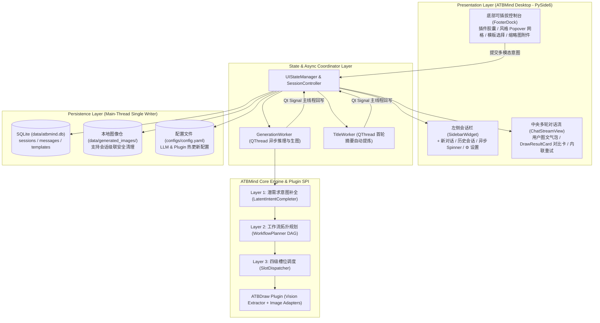

# ATBMind

<div align="center">

**面向多模态插件生态的三层意图推理引擎与多轮智能对话桌面平台**

[](https://www.python.org/downloads/)
[-41CD52.svg)](https://www.qt.io/qt-for-python)
[](https://pytest.org)
[-brightgreen.svg)](tests/benchmarks/benchmark_draw.py)
[](LICENSE)

</div>

---

## 📖 项目简介

**ATBMind** 是一个集成了**三层认知推理内核 (Three-Layer Cognitive Engine)** 与**可插拔多模态插件架构**的跨平台桌面级 AI 智能体应用框架。

在架构设计上，**ATBMind** 作为核心宿主平台（Host Platform），提供多会话管理、多轮连续上下文交互、异步任务并发调度以及本地持久化存储；而 **ATBDraw** 则作为平台搭载的首个旗舰级图像生成与智能人像精修插件（Plugin），通过声明式 UI 规约（`PluginUISpec`）无缝嵌入主界面底部控制台与对话卡片流中，将用户模糊的大白话口语指令转化为拓扑有序的专业图像处理工作流。



---

## ✨ 核心特性

### 1. 宿主与插件解耦的现代化桌面体验 (Apple HIG Light UI)
- **三段式主流 AI 交互范式**：
  - **左侧导航栏 (`SidebarWidget`)**：支持一键开启 `+ 新对话 (⌘N)`（默认纯文本通用对话，按需挂载插件）、按更新时间排序的会话历史管理、后台任务运行 Spinner 状态指示器，以及全局 `⚙️ 设置` 入口。
  - **中央多轮对话流 (`ChatStreamView`)**：流式呈现多轮对话。当调用 ATBDraw 插件时，内嵌渲染高颜值双列对比卡片（`DrawResultCard`，支持 `Before / After` 原图与精修图并排对比、全尺寸大图预览 `ImageViewerDialog`、一键另存为）。
  - **连续多轮微调闭环**：点击卡片上的 `[↺ 以此结果微调]`，自动将该轮生成图挂载为下一轮输入框的缩略图附件（Attachment Chip）并预填引导词，实现符合直觉的多轮渐进式精修。
  - **底部可插拔控制台 (`FooterDock`)**：未加载插件时保持极简文本输入；挂载 **ATBDraw** 后动态展开模型选择器、长宽比、对标豆包体验的**艺术风格弹出网格 (`StylePopover`)** 以及修图模板选择器。

### 2. 三层认知推理内核 (`atbmind_core`)
- **Layer 1: 潜需求意图补全 (`LatentIntentCompleter`)**：结合领域常识规则与视觉主体检测，将“把右边的人稍微变瘦，衣服别走样”自动推导补全出显式目标与服装边缘防畸变、背景防拉扯等隐式保护需求。
- **Layer 2: 工作流拓扑规划 (`WorkflowPlanner`)**：防大模型幻觉过滤，自动解析模板前置依赖并执行有向无环图 (DAG) 拓扑排序。
- **Layer 3: 四级优先级槽位调度 (`SlotDispatcher`)**：按 `用户覆盖 > 草稿参数 > 规划器绑定 > 模板默认` 自动注入参数并驱动插件链式执行。

### 3. 首发旗舰插件：ATBDraw (`plugins/draw`)
- **标准插件 SPI 与 UI 声明契约**：通过 `get_ui_spec()` 向宿主声明支持的模型（Seedream 4.5 / Flux.1 / SDXL / Mock）、画幅比例、艺术风格（人像摄影、电影写真、中国风、动漫、3D渲染、赛博朋克、水墨画、油画等）及模板列表。
- **精选 360 条人像精修种子模板**：涵盖人像修形、面部微雕、双频磨皮光影、衣物与背景防畸变联动四大核心分类。
- **双模生图适配器**：内置 `< 5ms` 离线验证 `MockImageAdapter` 与兼容 OpenAI / SiliconFlow 协议的云端生成适配器 `CloudImageAdapter`。

### 4. 工程级稳健性与完整本地持久化
- **非阻塞多会话并发 (`QThread`)**：生图推理与首轮会话标题自动摘要（`TitleWorker`）均在绑定 `session_id` 的独立后台线程运行，生图期间用户可自由切换会话而不丢失进度。
- **主线程单向写库模型**：后台 Worker 仅通过 Qt Signal 派发结果，由 UI 主线程统一写入 SQLite（WAL 模式），彻底规避多线程数据库锁冲突。
- **级联磁盘清理**：删除会话时自动清理 `data/generated_images/` 下关联的本地缓存图片，杜绝磁盘垃圾堆积。

---

## 📂 项目目录结构

```text
ATBMind/
├── apps/
│   ├── atbmind_desktop/           # [主程序] ATBMind 统一多轮对话与插件平台客户端
│   │   ├── main.py                # 桌面应用统一启动入口
│   │   ├── main_window.py         # 核心主窗口 (统筹 Sidebar / ChatStream / FooterDock)
│   │   ├── state.py               # 全局会话状态机与插件参数恢复控制器
│   │   ├── workers.py             # 后台异步线程 (GenerationWorker & TitleWorker)
│   │   └── widgets/               # 模块化 UI 组件群
│   │       ├── sidebar.py         # 左侧会话管理与设置入口
│   │       ├── chat_stream.py     # 中央滚动消息流
│   │       ├── message_bubble.py  # 用户/助手气泡与内联错误重试卡 (ErrorResultCard)
│   │       ├── footer_dock.py     # 底部可插拔插件控制栏与多模态输入框
│   │       ├── style_popover.py   # 艺术风格网格弹出浮层
│   │       ├── image_viewer.py    # 全尺寸大图预览模态框
│   │       └── settings_dialog.py # LLM API 配置与连通性测试弹窗
│   └── atb_draw_desktop/          # [独立原型/兼容] 单窗口人像精修调试端
├── atbmind_core/                  # ATBMind 核心推理与存储内核
│   ├── config.py                  # 配置加载、环境变量覆盖与 YAML 双向安全写回
│   ├── engine/                    # 三层认知推理引擎
│   │   ├── llm_client.py          # OpenAI 协议兼容客户端 (DeepSeek / OpenAI / Ollama)
│   │   ├── completer.py           # Layer 1: 潜需求意图补全器
│   │   ├── planner.py             # Layer 2: 模板匹配与 DAG 拓扑规划器
│   │   └── dispatcher.py          # Layer 3: 槽位填充与执行调度器
│   ├── plugins/                   # 标准插件 SPI 与注册发现服务
│   │   ├── base.py                # ATBMindPlugin 抽象基类 (含 get_ui_spec 契约)
│   │   ├── schemas.py             # Pydantic v2 数据模型 (SessionRecord, MessageRecord, PluginUISpec)
│   │   └── registry.py            # 插件动态扫描与生命周期注册中心
│   └── storage/                   # 本地 SQLite 持久化层
│       ├── db.py                  # TemplateStore 模板元数据毫秒级索引
│       └── session_store.py       # SessionStore 多轮会话、消息流与图片级联清理
├── plugins/
│   └── draw/                      # ATBDraw 首发图像生成与人像精修插件
│       ├── plugin.py              # DrawPlugin 核心实现与 UI 规格声明
│       ├── ui/draw_card.py        # DrawResultCard 前后对比结果卡片组件
│       ├── vision/extractor.py    # 视觉主体与语义 Mask 提取器
│       ├── prompts/injection.py   # 人像精修领域潜需求常识规则
│       ├── adapters/              # 图像模型适配器 (Mock & Cloud API)
│       └── templates/             # 360 条标准化种子模板元数据
├── configs/
│   └── config.yaml                # 应用全局配置文件 (LLM & 插件配置)
├── docs/
│   ├── superpowers/specs/         # 平台架构重构设计规范文档
│   └── packaging_guide.md         # 跨平台原生编译与分发指南
├── scripts/
│   ├── build_nuitka.sh            # Nuitka 跨平台原生二进制打包脚本
│   └── validate_templates.py      # 种子模板库校验工具
├── tests/
│   ├── benchmarks/                # 50 组端到端口语基准评测套件
│   └── test_*.py                  # 全量单元与 PySide6 (qtbot) 集成测试套件
├── LICENSE                        # GNU GPLv3 开源许可证
└── requirements.txt               # 项目依赖声明
```

---

## 🛠️ 环境准备

### 1. 创建并激活 Conda 环境
推荐使用 Python 3.12+：
```bash
conda create -n ATBMind python=3.12 -y
conda activate ATBMind
```

### 2. 安装项目依赖
```bash
pip install -r requirements.txt
```

---

## 🚀 运行指南

### 1. 启动 ATBMind 桌面客户端
激活 `ATBMind` 环境后，运行桌面端主程序：
```bash
# 启动 ATBMind 统一桌面平台
python apps/atbmind_desktop/main.py

# 或启动独立 ATBDraw 调试端
python apps/atb_draw_desktop/main.py
```

> **交互工作流体验**：
> 1. **新建或切换会话**：点击左侧栏 `+ 新对话 (⌘N)` 开启通用会话；在底部 Footer 点击 `[+ 载入插件]` 选择 **ATBDraw (图像生成)**。
> 2. **配置绘图参数**：在底部插件工具栏按需选择模型（如 `Seedream 4.5`）、长宽比、点击 `🎨 风格` 在弹出浮层中选定艺术风格，或指定修图模板。
> 3. **多模态输入**：点击输入框左侧 `[+]` 上传或直接拖入本地人像照片（输入框内将生成原图缩略图 Chip），输入大白话指令（如：“*把右边的人稍微变瘦，衣服别走样*”），按 `Enter` 发送。
> 4. **查看对比与连续微调**：在对话流生成的 `DrawResultCard` 中查看修前/修后对比图；点击 `[↺ 以此结果微调]` 可将当前成图自动挂入下一轮附件，继续对话微调；点击 `[💾 另存为]` 导出高清结果。
> 5. **配置 LLM API**：点击左下角 `⚙️ 设置`，在弹窗中配置 OpenAI / DeepSeek / Ollama 的 Base URL 与 API Key，支持一键测试连接与热更新保存。

### 2. 配置文件说明 (`configs/config.yaml`)
默认内置离线 `MockImageAdapter`，零配置即可体验完整的多轮交互与卡片生成流程。如需连接云端大模型与扩散模型，可在 UI 设置弹窗中修改或直接编辑 `configs/config.yaml`：

```yaml
llm:
  provider: "deepseek" # 支持 openai / deepseek / ollama / local
  base_url: "https://api.deepseek.com/v1"
  api_key: "your-api-key"
  model: "deepseek-chat"
  temperature: 0.2

plugins:
  enabled_plugins:
    - "draw"
```

---

## 🧪 自动化测试与基准评测

### 1. 运行全量单元与 UI 集成测试
使用 `pytest` 与 `pytest-qt` 执行全部自动化测试：
```bash
PYTHONPATH=. conda run -n ATBMind python -m pytest tests/
```

### 2. 运行 50 组人像精修端到端基准评测
自动化验证 50 组模糊口语短句的潜需求推理准确率与 DAG 拓扑排序合法率：
```bash
PYTHONPATH=. conda run -n ATBMind python -m pytest tests/benchmarks/benchmark_draw.py -s
```
**基准输出**：
```text
[BENCHMARK REPORT] Passed: 50/50 | Accuracy: 100.0%
============================== 1 passed in 0.19s ===============================
```

### 3. 校验种子模板库完整性
```bash
conda run -n ATBMind python scripts/validate_templates.py plugins/draw/templates/seed_templates.json
```

---

## 📦 独立打包与发布构建

项目提供基于 [Nuitka](https://nuitka.net/) 的原生编译脚本，可将 Python 运行时、PySide6 界面库、SQLite 存储模块及种子模板一键打包为免安装独立可执行程序：

```bash
# 1. 构建参数预检 (Dry Run)
bash scripts/build_nuitka.sh --dry-run

# 2. 执行原生编译 (产物输出至 dist/ 目录)
bash scripts/build_nuitka.sh
```

更多关于跨平台构建细节与冒烟测试清单，请参阅：[docs/packaging_guide.md](docs/packaging_guide.md) 与架构设计规范 [docs/superpowers/specs/2026-09-29-atbmind-ui-redesign-design.md](docs/superpowers/specs/2026-09-29-atbmind-ui-redesign-design.md)。

---

## 📄 开源许可证 (License)

本项目基于 **[GNU General Public License v3.0 (GPLv3)](LICENSE)** 开源授权发布。

您可以自由地使用、修改和分发本软件，但任何基于本项目的衍生作品或分发版本均须遵循 GPLv3 协议保持开源并提供完整源代码。详情请参阅根目录下的 [LICENSE](LICENSE) 文件。
