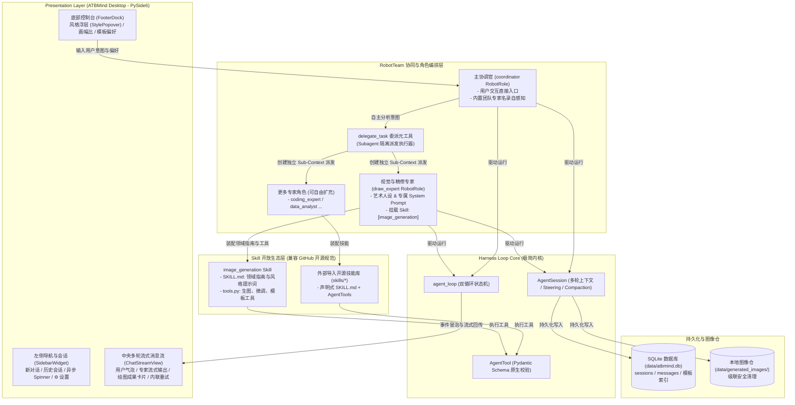

# ATBMind

<div align="center">

**基于精简 Harness Loop 内核、RobotRole 专家团队与开放 Skill 技能生态的桌面级 AI 智能体平台**

[](https://www.python.org/downloads/)
[-41CD52.svg)](https://www.qt.io/qt-for-python)
[](https://pytest.org)
[](docs/superpowers/specs/2026-10-07-robotrole-skill-architecture-design.md)
[](LICENSE)

</div>

---

## 📖 项目简介与设计理念

**ATBMind** 是一个现代化的多智能体协同桌面平台。在经过全面架构重构后，系统彻底摒弃了臃肿死板的传统插件（Plugin）与静态流水线概念，进化为**“精简底座内核 + 专家角色团队 + 开放技能生态”**的现代化 Agent 架构：

1. **底座内核 (Loop Harness Core)**：以极简的 Pi-Style 状态机为底座，负责细粒度事件流派发、上下文管理、工具调用派发、Steering 消息热注入与协同中断。
2. **专家角色 (RobotRole)**：每位专家角色拥有独特的个性（Personality）、专注领域的 System Prompt、专属模型配置，并挂载专属技能包（如 `draw_expert` 视觉专家）。
3. **主从团队 (RobotTeam)**：用户默认与团队主协调员（`coordinator`）对话；协调员具备元工具 `delegate_task`，可自主拆解复杂需求并将子任务派发给专家角色，各角色在独立的 Sub-Harness 循环中闭环执行并汇总成果。
4. **开放技能 (Skill Ecosystem)**：兼容现代开源生态规范（融合标准 `SKILL.md` 领域指南与 `tools.py` 执行体），支持直接从 GitHub 导入开源技能库，用户可零门槛组建属于自己的专家工作团队。



---

## ✨ 核心特性

### 1. 团队主从协同与 Subagent 派发
- **清晰边界与上下文防污染**：主协调员面对用户，子专家的中间思考过程和工具重试信息运行于独立的 `AgentContext` 中，仅将最终结论和交付成果（如生图路径）带回主会话，极大节省 Token 并保持历史记录干净。
- **全流程实时可观测 (Event Bubbling)**：子专家在运行工具时（如正在渲染或执行分析），中间事件实时冒泡透传给桌面端，UI 即时显示 `[draw_expert 正在执行 generate_image]`。

### 2. 开放式技能包规范 (A + C 结合)
- **开箱即用，无缝导入**：将 GitHub 上的 Agent 技能目录直接放入 `skills/` 即可被系统自动识别与加载。
- **双模能力融合**：每个技能目录包含 `SKILL.md`（YAML 元数据 + 领域规范指南）和 `tools.py`（基于 Pydantic 的可执行 `AgentTool`）。角色装备技能时，指南会自动注入 System Prompt，工具会自动注册到调用列表。

### 3. 旗舰专家：视觉绘图与精修专家 (`draw_expert`)
- **多风格与人像精修**：精通人像摄影、电影写真、中国风、动漫、3D渲染、赛博朋克等风格，内置自然瘦身、双频原生磨皮、服装防畸变等模板调度能力。
- **双模图像适配器**：支持离线毫秒级验证的 `MockImageAdapter` 与兼容云端扩散模型协议的 `CloudImageAdapter`。

### 4. 现代化桌面交互 (Apple HIG Light UI)
- **三段式精致布局**：优雅的侧边栏、实时流式 Markdown 气泡、绘图前后卡片对比预览（`Before / After`）与大图查看器。
- **参数动态注入**：底部控制栏（`FooterDock`）的艺术风格和比例选择，无缝作为上下文偏好注入团队协同管线。

---

## 📂 项目目录结构

```text
ATBMind/
├── apps/
│   └── atbmind_desktop/           # [主程序] ATBMind 跨平台桌面客户端
│       ├── main.py                # 桌面端主程序启动入口
│       ├── main_window.py         # 核心主窗口 (统筹 Sidebar / ChatStream / FooterDock)
│       ├── state.py               # 全局会话状态机控制器
│       ├── workers.py             # 后台异步执行 Worker (GenerationWorker & TitleWorker)
│       └── widgets/               # Apple HIG 风格 UI 组件群 (chat, footer, cards, etc.)
├── skills/                        # 官方与导入的技能库 (遵循统一开放规范)
│   └── image_generation/          # 图像生成与精修技能包 (SKILL.md, tools.py, templates)
├── roles/                         # 专家角色库 (YAML 声明式配置)
│   ├── coordinator/               # 团队主协调官定义
│   │   └── role.yaml
│   └── draw_expert/               # 视觉绘图与精修专家定义
│       └── role.yaml
├── atbmind_core/                  # ATBMind 核心架构模块
│   ├── adapters/                  # 领域适配器层 (image: mock_adapter, cloud_adapter)
│   ├── harness/                   # 最精简 Pi-Style 微内核 (loop, session, stream, tools)
│   ├── runtime/                   # 运行时基础设施 (event_bus, tasks, subagents, telemetry)
│   │   ├── session.py             # AgentSession 会话管理与上下文控制
│   │   ├── stream.py              # 流式 LLM 客户端包装
│   │   ├── types.py               # 核心事件与消息数据类
│   │   └── tools/                 # 底座通用工具基类与原子工具
│   ├── roles/                     # 角色系统核心
│   │   ├── schema.py              # RobotRole 数据模型与 Prompt/Tool 合成
│   │   ├── loader.py              # role.yaml 动态解析器
│   │   ├── registry.py            # 角色扫描与注册中心
│   │   ├── team.py                # RobotTeam 团队协调中枢
│   │   └── delegation.py          # delegate_task 元工具 (Subagent 执行器)
│   ├── skills/                    # 技能系统核心
│   │   ├── schema.py              # Skill / SkillMetadata 模型
│   │   ├── loader.py              # SKILL.md 解析器与 tools.py 动态加载器
│   │   └── registry.py            # 技能扫描与注册中心
│   ├── storage/                   # 本地持久化层 (SQLite & Schemas)
│   │   ├── schemas.py             # SessionRecord / MessageRecord 存储模型
│   │   ├── session_store.py       # 会话与消息持久化、图片级联清理
│   │   └── db.py                  # 模板索引数据库
│   └── config.py                  # 应用配置解析与 YAML 安全回写
├── configs/
│   └── config.yaml                # 全局配置文件 (LLM 参数与配置)
├── data/
│   ├── atbmind.db                 # 本地 SQLite 数据库
│   └── generated_images/          # 生成图片物理存储仓
├── docs/
│   └── superpowers/specs/         # 架构演化设计规范文档 (Design Specs)
├── scripts/                       # 打包、运维与验证脚本
└── tests/                         # 179 项自动化单元与集成测试套件
```

---

## 🛠️ 快速开始

### 1. 环境准备
推荐使用 Python 3.12+ Conda 环境：
```bash
conda create -n ATBMind python=3.12 -y
conda activate ATBMind
pip install -r requirements.txt
```

### 2. 启动桌面客户端
```bash
python apps/atbmind_desktop/main.py
```

### 3. 配置 LLM 接口
点击左下角 `⚙️ 设置`，配置您的 OpenAI / DeepSeek / Ollama 接口参数：
- **Base URL**：例如 `https://api.openai.com/v1` 或 `https://api.deepseek.com/v1`
- **API Key**：填入您的 API 密钥
- **Model**：如 `gpt-4o` 或 `deepseek-chat`

---

## 🧩 如何扩展：添加自定义 Skill 与 RobotRole

### 1. 添加自定义 Skill
在 `skills/` 下新建一个目录（例如 `skills/web_search/`）：

1. 创建 `SKILL.md`：
```markdown
---
name: web_search
description: 互联网网页搜索与实时信息检索技能
version: 1.0.0
tags: ["search", "web"]
---
# Web Search Guidelines
检索网络信息时，请优先提取事实来源并给出权威引用。
```

2. 创建 `tools.py`：
```python
from pydantic import BaseModel, Field
from atbmind_core.harness.tools.base import AgentTool, ToolResult

class SearchInput(BaseModel):
    query: str = Field(..., description="搜索关键词")

class WebSearchTool(AgentTool):
    name = "web_search"
    description = "执行实时网页关键词检索"
    parameters_schema = SearchInput

    async def execute(self, args, context=None):
        query = args["query"]
        return ToolResult(content=f"搜索结果: 关于 '{query}' 的最新资料...")
```

### 2. 创建自定义 RobotRole 专家
在 `roles/` 下新建一个目录（例如 `roles/researcher/role.yaml`）：

```yaml
role_id: "researcher"
name: "学术与资料检索专家"
description: "擅长深度信息搜集、专业文献查证与事实核验"
personality: "严谨、求真、逻辑条理清晰"
system_prompt: |
  你是团队中的资深学术与信息研究专家。你擅长使用搜索技能获取第一手真实资料，并输出系统性调研报告。
skills:
  - web_search
model: "gpt-4o"
temperature: 0.3
```

重启或刷新系统后，主协调员 `coordinator` 会自动感知并把该专家加入名录，当用户要求查找资料时，协调员将自主调用 `delegate_task("researcher", ...)` 派发任务！

---

## 🧪 自动化测试验证

全量执行 179 项自动化测试（覆盖内核状态机、角色加载、技能解析、Subagent 派发与 PySide6 界面集成）：
```bash
PYTHONPATH=. conda run -n ATBMind python -m pytest tests/
```

输出示例：
```text
============================= 179 passed in 4.42s ==============================
```

---

## 📄 开源许可证 (License)

本项目基于 **[GNU General Public License v3.0 (GPLv3)](LICENSE)** 开源授权发布。
