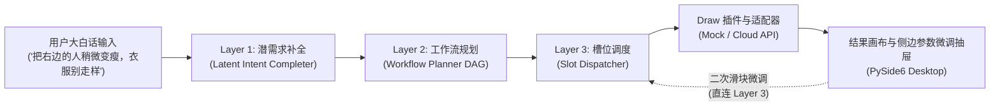

# ATBMind

<div align="center">

**面向领域智能图像处理的三层意图推理引擎与跨平台应用框架**

[](https://www.python.org/downloads/)
[](https://www.qt.io/qt-for-python)
[](https://pytest.org)
[-brightgreen.svg)](tests/benchmarks/benchmark_draw.py)
[](LICENSE)

</div>

---

## 📖 项目简介

**ATBMind** 是一个以“静默缺省 + 结果侧抽屉微调”为人机交互核心理念的智能指令编排与图像生成框架。它将用户模糊、低带宽的大白话口语指令，通过三层推理架构转化为拓扑有序的领域模板工作流，并结合首发插件 **ATBMind-Draw** 与 **ATBDraw 桌面端应用**，提供端到端开箱即用的人像自然精修体验。



### 核心特性
- **三层认知推理架构**：
  - **Layer 1 (Latent Intent Completer)**：结合领域规则与视觉实体，自动推导服装保护、背景防拉扯等隐式潜需求。
  - **Layer 2 (Workflow Planner)**：防大模型幻觉过滤，自动解析模板前置依赖，执行有向无环图 (DAG) 拓扑排序。
  - **Layer 3 (Slot Dispatcher)**：按四级优先级（`用户覆盖 > 草稿参数 > 规划器绑定 > 模板默认`）自动注入槽位并链式执行。
- **ATBMind-Draw 插件体系**：
  - 标准插件接口 SPI，支持本地目录与 `entry_points` 动态发现。
  - 精选 **360 条**高频人像精修种子模板库，覆盖四大核心分类（人像修形、面部微雕、质感光影、衣物与背景防畸变联动）。
  - 双适配器支持：离线 `< 5ms` 水印标记 Mock 适配器与云端 SiliconFlow / OpenAI 扩散模型 API 适配器。
- **ATBDraw 极简桌面端应用 (PySide6)**：
  - 支持本地图片拖拽导入、修前/修后对比预览与一键另存为。
  - 结果侧微调抽屉：动态呈现调用模板与参数滑块，调节后直连 Layer 3 毫秒级重跑刷新。
- **高基准测试达标率**：50 组人像精修端到端大白话短句真实测试用例，匹配准确率与拓扑顺序合法率均达到 **100.0%**。
- **原生独立打包分发**：提供基于 Nuitka 的一键打包脚本，免环境依赖生成跨平台原生可执行文件。

---

## 📂 项目目录结构

```text
ATBMind/
├── apps/
│   └── atb_draw_desktop/          # ATBDraw 桌面端客户端
│       ├── main.py                # 桌面主窗口、画布与主事件流
│       └── drawer.py              # 结果侧参数微调抽屉组件
├── atbmind_core/                  # ATBMind 核心推理内核
│   ├── config.py                  # 配置管理与模型参数加载
│   ├── engine/                    # 三层引擎实现
│   │   ├── llm_client.py          # 统一兼容 OpenAI 协议客户端 (云端/Ollama)
│   │   ├── completer.py           # Layer 1: 潜需求意图补全器
│   │   ├── planner.py             # Layer 2: 模板匹配与拓扑规划器
│   │   └── dispatcher.py          # Layer 3: 槽位填充与执行调度器
│   ├── plugins/                   # 标准插件 SPI 与注册发现服务
│   │   ├── base.py                # ATBMindPlugin 抽象基类
│   │   ├── schemas.py             # Pydantic v2 标准数据契约规范
│   │   └── registry.py            # 插件动态扫描与生命周期注册中心
│   └── storage/                   # 本地存储与索引模块
│       └── db.py                  # SQLite 模板元数据库 (毫秒级批量检索)
├── plugins/
│   └── draw/                      # ATBMind-Draw 图像精修首发插件
│       ├── plugin.py              # DrawPlugin 实现
│       ├── vision/extractor.py    # 轻量视觉主体与语义 Mask 提取器
│       ├── prompts/injection.py   # 人像精修领域潜需求常识规则
│       ├── adapters/              # 图像底层模型适配器 (Mock & Cloud API)
│       └── templates/             # 360 条标准化种子模板元数据
├── configs/
│   └── config.yaml                # 应用全局配置文件
├── scripts/
│   ├── build_nuitka.sh            # Nuitka 跨平台原生打包脚本
│   └── validate_templates.py      # 种子模板校验与生成脚本
├── tests/
│   ├── benchmarks/                # 50 组端到端口语基准评测套件
│   └── test_*.py                  # 单元与集成测试套件 (52 项用例)
├── docs/                          # 设计规格与打包发布文档
└── requirements.txt               # 项目依赖声明
```

---

## 🛠️ 环境准备

### 1. 创建并激活 Conda 环境
推荐使用 Python 3.12+：
```bash
conda create -n ATBMind python=3.12 -y
conda activate ATBMind
```

### 2. 安装项目依赖
```bash
pip install -r requirements.txt
```

---

## 🚀 运行方法

### 1. 启动 ATBDraw 桌面端应用 (GUI)
确保已激活环境，在项目根目录下运行：
```bash
python apps/atb_draw_desktop/main.py
```
> **使用提示**：
> 1. 将任意人像照片拖入左侧画布，或点击“选择本地图片”。
> 2. 在底部输入框输入自然语言指令（例如：“*把右边的人稍微变瘦，衣服别走样*” 或 “*收一下小蛮腰，消除法令纹，不要假面感*”）。
> 3. 点击“**心眼生成 ✨**”立即出图。
> 4. 生成后在右侧抽屉滑动调节强度（如 `intensity`、`preserve_ratio`），点击“**微调重新生成 ⚡**”秒级局部刷新。
> 5. 满意后点击“**另存为 💾**”导出图片。

### 2. 命令行快速检查版本
```bash
python apps/atb_draw_desktop/main.py --version
# 输出: ATBDraw 0.1.0 (ATBMind Core 0.1.0)
```

### 3. 配置云端真实绘图与大模型 API（可选）
默认配置使用内置的 `MockImageAdapter`，无需配置任何 API Key 即可进行离线完整出图体验。若需接入真实云端大模型与扩散模型 API，请编辑 `configs/config.yaml`：

```yaml
llm:
  provider: "deepseek" # 或 openai / ollama
  base_url: "https://api.deepseek.com/v1"
  api_key: "your-api-key"
  model: "deepseek-chat"

plugins:
  draw:
    adapter: "cloud" # 切换为云端生图
    base_url: "https://api.siliconflow.cn/v1"
    api_key: "your-siliconflow-key"
    model: "black-forest-labs/FLUX.1-dev"
```

---

## 🧪 自动化测试与基准评测

### 1. 运行全量单元与集成测试
运行包含配置、插件规范、模型客户端、三层推理引擎、SQLite 存储及 PySide6 界面在内的全部 52 项测试：
```bash
PYTHONPATH=. pytest tests/
```

### 2. 运行 50 组人像精修端到端基准评测
自动化量化评测 50 组模糊口语短句全流程匹配准确率与 DAG 拓扑顺序：
```bash
PYTHONPATH=. pytest tests/benchmarks/benchmark_draw.py -s
```
**输出效果**：
```text
[BENCHMARK REPORT] Passed: 50/50 | Accuracy: 100.0%
============================== 1 passed in 0.19s ===============================
```

### 3. 校验种子模板库完整性
```bash
python scripts/validate_templates.py plugins/draw/templates/seed_templates.json
# [OK] Validated 360 templates across 4 categories and imported into SQLite with 0 errors.
```

---

## 📦 独立打包与发布构建

项目提供基于 [Nuitka](https://nuitka.net/) 的一键原生打包工具，能够将 Python 代码、PySide6 运行时、种子模板和配置文件编译打包为独立的二进制执行程序，在未安装 Python 环境的干净操作系统上可直接运行。

### 1. 构建参数预检 (Dry Run)
```bash
bash scripts/build_nuitka.sh --dry-run
```

### 2. 执行独立原生编译
```bash
# 执行完整构建（产物位于 dist/ 目录）
bash scripts/build_nuitka.sh

# 自定义输出目录
bash scripts/build_nuitka.sh --output-dir=./build_output
```

### 3. 构建产物验证
- **macOS**：
  ```bash
  ./dist/ATBDraw.app/Contents/MacOS/ATBDraw --version
  ```
- **Windows / Linux**：
  ```bash
  dist/ATBDraw --version
  ```

更多关于跨平台构建细节与冒烟测试检查清单，请参阅完整文档：[docs/packaging_guide.md](docs/packaging_guide.md)。

---

## 📄 开源许可证

本项目基于 [MIT License](LICENSE) 开源发布。
