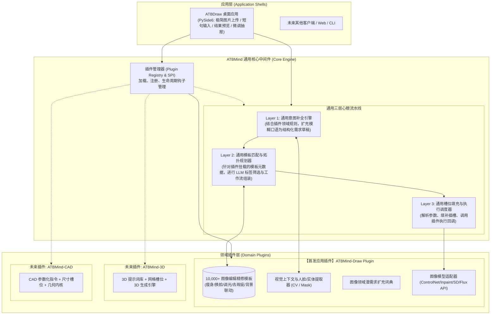
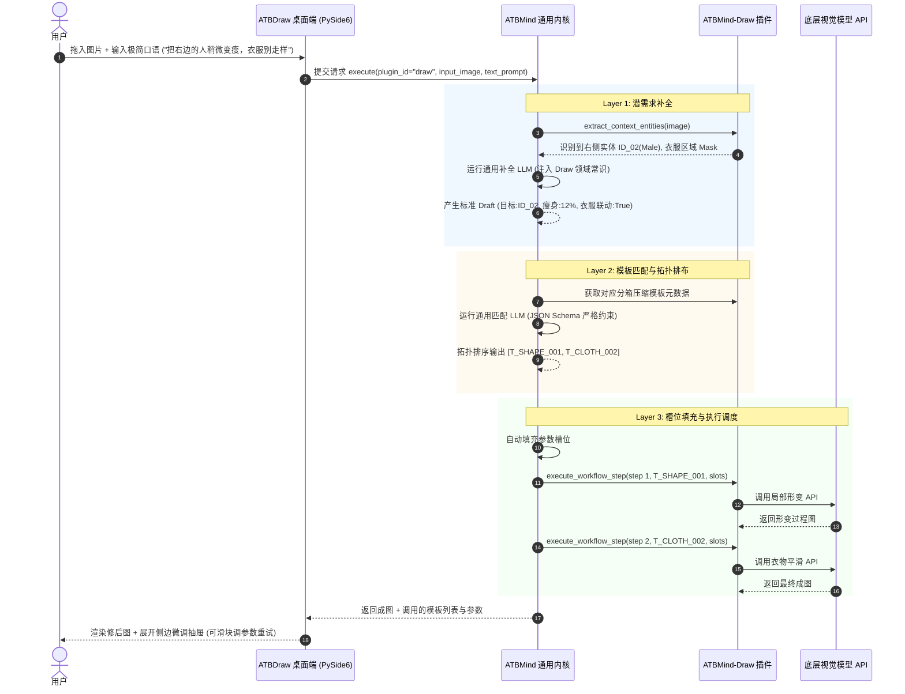

# ATBMind (心引) 通用指令中间件与插件系统架构设计说明书

> **文档版本**: v1.1.0  
> **核心定位**: 通用提示词与用户指令桥接中间件 (Universal Prompt-to-Intent Middleware)  
> **首发插件**: ATBMind-Draw (图像生成与精修插件)  
> **状态**: 架构评审与 MVP 实施规范  
> **最后更新**: 2026-09-28  

---

## 1. 项目定位与核心愿景 (Project Overview & Vision)

### 1.1 核心问题：语言带宽与精密工具的断层
随着大语言模型（LLM）与领域多模态模型的发展，人机交互正全面转向以自然语言为驱动。然而在实际生产环境中，存在一个巨大鸿沟：
1. **用户侧（语言带宽极低、表达模糊）**：
   - 用户往往只给出一句极简、口语化的短句（例如：“把这个人变瘦一点”、“做个赛博朋克风的机械零件”）。
   - 普通用户不知道底层 AI 的专业参数，无法用专业术语精确描述“先做什么、再做什么、各参数取值多少”，**无法有效唤醒 AI 的深层能力**。
2. **能力侧（指令模板丰富、控制精密但门槛极高）**：
   - 开发者或专业领域积累了**海量高质量的提示词与指令模板（Prompt Templates）**，这些模板具备极高的控制精度与多步骤编排能力。
   - 但是，这些精密模板无法直接对齐用户的模糊口语输入。

### 1.2 核心定位：ATBMind 通用中间件
**ATBMind** 是一个**通用的、跨领域的提示词与用户指令桥接中间件 (Universal Prompt-to-Intent Middleware)**。

- **核心使命**：作为连接“用户模糊意图”与“海量专业领域提示词/指令集”之间的智能心眼桥梁。
- **核心机制**：
  1. **海量提示词模板元数据索引**：统一管理与索引数万条各领域的成熟指令模板。
  2. **潜需求补全与歧义消解 (Intent Expansion & Disambiguation)**：结合上下文与领域常识，将极简口语扩充为规范的结构化需求草稿。
  3. **拓扑编排与模板映射 (Topological Workflow Matching)**：在大模型指导下，将结构化需求精准映射到最佳候选模板组合，形成确定性的 DAG 工作流。
  4. **槽位填充与执行调度 (Slot Filling & Dispatching)**：自动填充参数并调度领域执行引擎。
- **通用性本质**：**ATBMind 内核完全与具体业务领域解耦**。它不绑定画图、不绑定 3D，而是提供一套通用的指令桥接内核与标准插件机制（Plugin Architecture）。

```
+---------------------------------------------------------------------------------------+
|                                  用户层 (User Inputs)                                 |
|                         模糊自然语言短句 ("把这个人变瘦一点")                          |
+-------------------------------------------+-------------------------------------------+
                                            |
                                            v
+---------------------------------------------------------------------------------------+
|                                ATBMind 通用核心中间件                                 |
|  [通用潜需求补全引擎] -> [通用模板匹配与 DAG 规划器] -> [通用槽位填充与流水线调度器]  |
|                                           ^                                           |
|                               [标准插件接口 SPI / 注册中心]                           |
+-------------------------------------------+-------------------------------------------+
                                            | 插件挂载 (Pluggable)
            +-------------------------------+-------------------------------+
            |                               |                               |
            v                               v                               v
+-----------------------+       +-----------------------+       +-----------------------+
|  插件 1: Draw (画图)  |       |  插件 2: 3D (建模)    |       |  插件 3: CAD/工业设计 |
|  - 10,000+ 修图提示词 |       |  - 3D 参数化生成模板  |       |  - CAD 实体建模指令   |
|  - 视觉实体/Mask 槽位 |       |  - 网格/材质/骨骼槽位 |       |  - 尺寸/公差/装配槽位 |
|  - 图像扩散模型执行器 |       |  - 3D 渲染执行器      |       |  - 工业几何引擎执行器 |
+-----------------------+       +-----------------------+       +-----------------------+
```

### 1.3 首发落地应用：ATBMind-Draw 插件
- **ATBMind-Draw 是 ATBMind 中间件体系孵化的第一个参考应用插件**。
- 它专注于 **2D 图像生成与人像精修场景**（因为图像领域数据最丰富、开源生态最成熟、用户痛点最直观）。
- 在验证完 ATBMind 内核架构与 Draw 插件后，将陆续拓展 `3D 建模`、`CAD 工业设计`、`生化实验流水线`、`结构化写作` 等后续应用插件。

---

## 2. 系统总体架构与插件化体系 (Architecture & Plugin System)

系统严格采用 **Core-Plugin（内核-插件）解耦架构**：
- **`ATBMind Core`**：通用内核，纯逻辑中枢，提供提示词索引、意图扩充、模板匹配编排、槽位调度和插件生命周期管理。
- **`ATBMind Plugins`**：领域插件包，承载特定领域的模板资产、实体抽取规则、专用提示词扩展与底层模型执行适配器。
- **`App / Client Shell`**：基于插件构建的上层用户应用（例如 `ATBDraw Desktop` 桌面客户端）。

### 2.1 整体分层架构图



---

## 3. 标准插件接口规范 (Plugin SPI Specification)

任何领域应用要接入 ATBMind，只需实现标准的 `ATBMindPlugin` 协议：

### 3.1 插件抽象基类接口 (Python Protocol)

```python
from abc import ABC, abstractmethod
from typing import List, Dict, Any, Optional
from pydantic import BaseModel

class TemplateMetadata(BaseModel):
    """通用模板元数据定义"""
    template_id: str                   # 唯一标识，如 T_DRAW_0102
    name: str                          # 模板名称
    category: str                      # 分类，如 body_shaping
    keywords: List[str]                # 关键词标签
    target_scope: str                  # 作用对象 (single_person / background / mesh)
    slot_definitions: Dict[str, Any]   # 槽位定义与类型说明
    dependencies: List[str] = []       # 依赖的前置模板 ID

class StructuredIntentDraft(BaseModel):
    """Layer 1 输出的通用结构化意图草稿"""
    intent_category: str
    target_entities: List[Dict[str, Any]]
    parameters: Dict[str, Any]
    plugin_payload: Optional[Dict[str, Any]] = None

class ATBMindPlugin(ABC):
    """ATBMind 标准插件接口定义 (SPI)"""

    @property
    @abstractmethod
    def plugin_id(self) -> str:
        """插件唯一 ID，如 'draw', '3d', 'cad'"""
        pass

    @property
    @abstractmethod
    def version(self) -> str:
        """插件版本号，如 '1.0.0'"""
        pass

    @abstractmethod
    def get_templates(self) -> List[TemplateMetadata]:
        """向中间件提供该领域的全部提示词/指令模板元数据"""
        pass

    @abstractmethod
    def extract_context_entities(self, raw_input: Any) -> Dict[str, Any]:
        """领域特定上下文提取器 (如 Draw 插件提取图片中人物数量、Mask；3D 插件提取几何体信息)"""
        pass

    @abstractmethod
    def get_domain_prompt_injection(self) -> str:
        """注入 Layer 1 潜需求补全的领域知识与常识规则"""
        pass

    @abstractmethod
    def execute_workflow_step(self, step_index: int, template_id: str, filled_slots: Dict[str, Any], context: Dict[str, Any]) -> Any:
        """执行具体的一步工作流 (调用具体领域的底层模型或 API)"""
        pass
```

---

## 4. 通用核心流水线详细机制 (Universal Core Engine Pipeline)

无论挂载何种插件，ATBMind 的三层心眼流水线运转逻辑均保持严格一致与通用。

### 4.1 Layer 1: 通用意图补全引擎 (Universal Latent Requirement Completer)
- **输入**：用户模糊自然语言（如：“把这个人变瘦一点”）+ 插件提取的领域上下文数据（如：检测到 2 男 1 女，中心人物为 `Male_01`）。
- **处理**：
  1. 调用挂载插件的 `get_domain_prompt_injection()`，动态拼接系统提示词；
  2. 执行**缺省值推导**（未提及幅度时，根据领域先验赋予推荐值 `12%`）；
  3. 执行**歧义消解**（未指定人时，绑定视觉对焦主体；开启衣物与背景防扭曲联动）。
- **输出**：生成与领域无关的 `StructuredIntentDraft` 结构化对象。

```json
{
  "request_id": "req_20260928_001",
  "plugin_id": "draw",
  "intent_category": "body_shaping",
  "target_entities": [
    { "entity_id": "entity_male_01", "role": "primary_target", "region": "center" }
  ],
  "parameters": {
    "intensity": 0.12,
    "direction": "slender",
    "clothing_sync": true,
    "background_lock": true
  }
}
```

---

### 4.2 Layer 2: 通用模板匹配与拓扑规划器 (Topological Workflow Planner)
ATBMind 管理插件提供的成千上万条提示词模板。核心机制不是全量加载，而是**分箱索引与语义大模型匹配**：

1. **元数据压缩与分箱**：
   - 模板库在插件初始化时加载到 SQLite，每条模板只保留 20-30 tokens 的压缩标签（ID + 关键词 + 作用域 + 依赖）。
   - 根据 Layer 1 的 `intent_category` 进行索引分箱粗筛，候选集收敛到 100~300 条以内。
2. **LLM 标签匹配选择器**：
   - 将精简后的压缩模板库作为参考列表，结合意图草稿输入给大模型。
   - **严格格式控制**：强约束 LLM 仅输出 JSON 格式的模板 ID 数组与执行次序，严禁大模型自行生成新提示词。
3. **工作流拓扑排布**：
   - 根据模板的 `dependencies`（如 `T_CLOTH_002` 依赖 `T_SHAPE_001`），自动验证并纠正执行流水线顺序（步骤 1: 骨架形态调节 -> 步骤 2: 服饰贴合跟随）。

```json
{
  "workflow_id": "wf_20260928_001",
  "matched_templates": [
    { "step": 1, "template_id": "T_SHAPE_001", "name": "人像轮廓形变微调" },
    { "step": 2, "template_id": "T_CLOTH_002", "name": "衣物形变贴合" }
  ]
}
```

---

### 4.3 Layer 3: 通用槽位填充与执行调度器 (Slot Filling & Dispatcher)
1. **槽位映射 (Slot Filling)**：
   - 读取命中模板的 `slot_definitions`，将 Layer 1 中的参数值（如 `intensity=0.12`, `target=entity_male_01`）自动注入槽位。
2. **插件执行调度 (Plugin Dispatching)**：
   - 依次触发挂载插件的 `execute_workflow_step()` 回调函数，流式执行底层模型调用。
3. **透明化反馈与二次交互通道**：
   - 将最终生成物（如图像、3D 文件）连同**所用模板列表、注入参数清单**一并返回上层应用。
   - 上层应用（如 ATBDraw）可在界面展示参数清单，支持用户手动修改滑块后重新向 Layer 3 派发局部更新。

---

## 5. 首发应用插件：ATBMind-Draw 详细设计

### 5.1 插件定位与资产封装
`ATBMind-Draw` 是专门为 2D 图像生成与人像精修定制的应用插件，它将团队手头现成的 **10,000+ 条经过生产验证的高精图像提示词模板** 进行标准化封装。

#### 5.1.1 模板分类体系
- **人像修形类 (Body & Face)**：瘦身、丰唇、下颌线微调、五官立体化、增肌。
- **质感与光影类 (Lighting & Texture)**：复古暖光、电影胶片感、丁达尔光、黑白高级灰。
- **背景与环境类 (Background & Cleanup)**：背景虚化、路人消除、背景扩展 (Outpainting)、场景置换。
- **风格化与特效类 (Style & Render)**：赛博朋克、吉卜力风、水彩质感、黏土风格。

#### 5.1.2 图像领域实体提取 (Context Extractor)
- 插件内置轻量视觉分析模块（人脸检测、人物分割 Mask 提取器），自动检测用户上传图片中的关键实体属性，辅助 Layer 1 消除代词歧义。

#### 5.1.3 底层图像大模型适配器 (Draw Executor)
- 支持无缝适配主流开源与商业出图 API：
  - **ComfyUI / Stable Diffusion WebUI** (ControlNet / Inpaint / LoRA)
  - **Flux.1 / SDXL 官方与云端 API**
  - **OpenAI DALL-E / Midjourney / 剪映/通义等商用修图服务**

---

## 6. 首个客户端落地：ATBDraw 桌面应用 (Desktop Shell)

### 6.1 用户交互流程闭环
`ATBDraw` 是基于 `ATBMind Core` + `ATBMind-Draw` 插件构建的极简 PySide6 桌面端：



---

## 7. 代码仓库与工程组织规范 (Monorepo Layout)

遵循“通用中间件内核”与“应用插件”解耦的目录组织体系：

```
ATBMind/
├── docs/                        # 系统架构与接口规范文档
│   └── design/
│       └── ATBMind-design.md
├── atbmind_core/                # [核心项目] ATBMind 通用中间件内核
│   ├── __init__.py
│   ├── plugins/                 # 插件管理子系统
│   │   ├── base.py              # ATBMindPlugin 抽象接口 (SPI)
│   │   ├── registry.py          # 插件动态发现与注册中心
│   │   └── schemas.py           # 通用元数据与数据模型 (Pydantic)
│   ├── engine/                  # 通用三层流水线引擎
│   │   ├── completer.py         # Layer 1: 通用意图补全器
│   │   ├── planner.py           # Layer 2: 通用模板匹配与拓扑规划器
│   │   └── dispatcher.py        # Layer 3: 通用槽位填充与分发执行器
│   ├── storage/                 # 通用存储层 (SQLite 模板元数据与缓存)
│   └── utils/
│
├── plugins/                     # [插件项目目录] 领域插件集合
│   ├── draw/                    # 【首发插件】图像生成与精修插件
│   │   ├── __init__.py
│   │   ├── plugin.py            # 实现 ATBMindPlugin 接口
│   │   ├── templates/           # 10,000+ 图像模板元数据库
│   │   │   └── image_templates.json
│   │   ├── vision/              # 图像实体抽取与人脸/Mask 分析器
│   │   ├── prompts/             # 图像领域补全常识与提示词
│   │   └── adapters/            # 底层图像模型 API 适配器 (SD/Flux/ComfyUI)
│   ├── model_3d/                # [未来规划] 3D 建模生成插件
│   └── cad/                     # [未来规划] CAD 工业设计指令插件
│
├── apps/                        # [应用落地层]
│   └── atb_draw_desktop/        # 基于 Draw 插件的 PySide6 桌面端演示应用
│       ├── main.py              # 应用入口
│       ├── views/               # 主界面、上传区、微调抽屉
│       └── controllers/         # 控制器 (直连 atbmind_core)
│
├── tests/                       # 测试套件
│   ├── test_core_engine.py      # 通用内核测试
│   └── test_plugin_draw.py      # Draw 插件专用测试
├── requirements.txt
└── README.md
```

---

## 8. 开源与商业化壁垒边界 (Moat & Business Strategy)

```
+-------------------------------------------------------------+
|                      开源生态层 (Open Core)                 |
|  - ATBMind Core 通用中间件引擎框架                         |
|  - 标准插件接口规范 (Plugin SPI)                           |
|  - 基础 Skill 提示词模板与示例插件代码                     |
+-------------------------------------------------------------+
                              |
                              v 衍生与赋能
+-------------------------------------------------------------+
|                    商业私有壁垒层 (Proprietary)             |
|  - 官方高性能垂直插件 (如 ATBMind-Draw 商业版)             |
|  - 私有 10,000+ 工业级精修提示词模板资产库                 |
|  - 真实意图到模板的匹配对齐数据集 (Data Flywheel)          |
|  - 面向企业私有系统（3D、CAD、工业流程）的定制化插件       |
+-------------------------------------------------------------+
```

---

## 9. 实施路线图与里程碑 (Roadmap)

保持个人独立开发者节奏（每日 2~3 小时），分为四个推进阶段：

1. **第一阶段：ATBMind 通用内核搭建 (Week 1)**
   - 建立单仓骨架，定义 `ATBMindPlugin` 抽象基类与通用数据模型。
   - 实现通用 Layer 1 潜需求补全引擎与 SQLite 模板元数据缓存机制。
2. **第二阶段：通用模板规划器与 Draw 插件接入 (Week 2)**
   - 实现 Layer 2 通用拓扑匹配规划器，支持严格 JSON Schema 输出。
   - 开发 `plugins/draw` 插件骨架，导入第一批（500 条高频）图像精修压缩模板，验证匹配准确率 > 90%。
3. **第三阶段：通用执行调度与 Draw 图像流水线贯通 (Week 3)**
   - 实现 Layer 3 槽位参数自动填充引擎与插件执行分发机制。
   - 在 Draw 插件中接入图像模型 API（如 Flux / SD Inpaint），打通 CLI 端到端出图闭环。
4. **第四阶段：ATBDraw 桌面端集成与验证 (Week 4)**
   - 开发 `apps/atb_draw_desktop`（PySide6 极简单页 GUI，带模板列表与微调抽屉）。
   - 使用 Nuitka 打包为本地原生程序，邀请 20 位种子用户内测，验证“短句意图 -> 模板组装 -> 完美出图”的全流程体验。
5. **后续演进：拓展更多领域插件**
   - 启动 `plugins/model_3d` 与 `plugins/cad` 预研，进一步巩固 ATBMind 作为通用领域指令中间件的核心价值。
