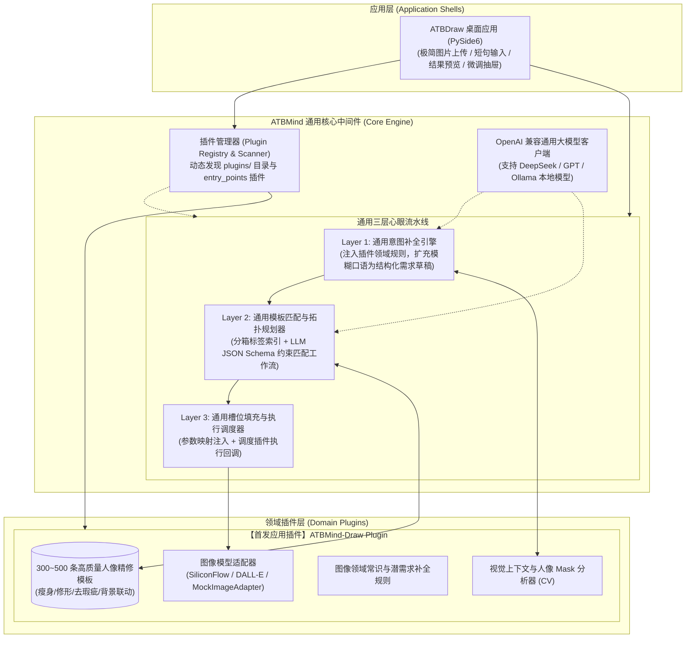
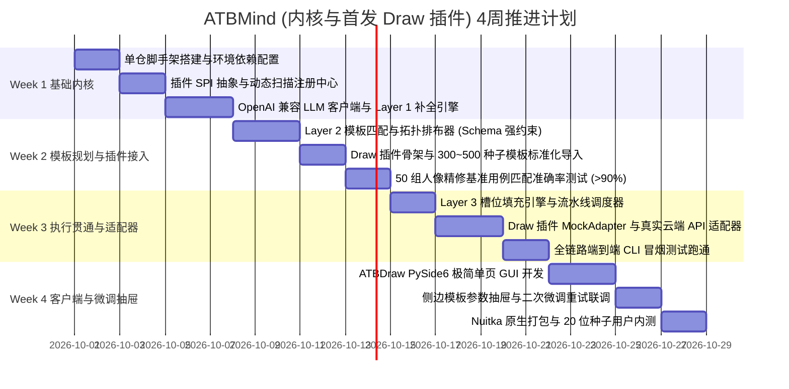

# ATBMind (心引) 通用指令中间件与插件系统架构设计说明书

> **文档版本**: v1.2.0  
> **核心定位**: 通用提示词与用户指令桥接中间件 (Universal Prompt-to-Intent Middleware)  
> **首发插件**: ATBMind-Draw (图像生成与精修插件)  
> **状态**: 架构评审通过 / 实施就绪 (Implementation Ready)  
> **最后更新**: 2026-09-28  

---

## 1. 项目定位与核心愿景 (Project Overview & Vision)

### 1.1 核心问题：语言带宽与精密工具的断层
随着大语言模型（LLM）与领域多模态模型的发展，人机交互正全面转向以自然语言为驱动。然而在实际生产环境中，存在一个巨大鸿沟：
1. **用户侧（语言带宽极低、表达模糊）**：
   - 用户往往只给出一句极简、口语化的短句（例如：“把这个人变瘦一点”、“做个赛博朋克风的机械零件”）。
   - 普通用户不知道底层 AI 的专业参数，无法用专业术语精确描述“先做什么、再做什么、各参数取值多少”，**无法有效唤醒 AI 的深层能力**。
2. **能力侧（指令模板丰富、控制精密但门槛极高）**：
   - 开发者或专业领域积累了**海量高质量的提示词与指令模板（Prompt Templates）**，这些模板具备极高的控制精度与多步骤编排能力。
   - 但是，这些精密模板无法直接对齐用户的模糊口语输入。

### 1.2 核心定位：ATBMind 通用中间件
**ATBMind** 是一个**通用的、跨领域的提示词与用户指令桥接中间件 (Universal Prompt-to-Intent Middleware)**。

- **核心使命**：作为连接“用户模糊意图”与“海量专业领域提示词/指令集”之间的智能心眼桥梁。
- **核心机制**：
  1. **海量提示词模板元数据索引**：统一管理与索引数万条各领域的成熟指令模板。
  2. **潜需求补全与歧义消解 (Intent Expansion & Disambiguation)**：结合上下文与领域常识，将极简口语扩充为规范的结构化需求草稿。
  3. **拓扑编排与模板映射 (Topological Workflow Matching)**：在大模型指导下，将结构化需求精准映射到最佳候选模板组合，形成确定性的 DAG 工作流。
  4. **槽位填充与执行调度 (Slot Filling & Dispatching)**：自动填充参数并调度领域执行引擎。
- **通用性本质**：**ATBMind 内核完全与具体业务领域解耦**。它不绑定画图、不绑定 3D，而是提供一套通用的指令桥接内核与标准插件机制（Plugin Architecture）。

```
+---------------------------------------------------------------------------------------+
|                                  用户层 (User Inputs)                                 |
|                         模糊自然语言短句 ("把这个人变瘦一点")                          |
+-------------------------------------------+-------------------------------------------+
                                            |
                                            v
+---------------------------------------------------------------------------------------+
|                                ATBMind 通用核心中间件                                 |
|  [通用潜需求补全引擎] -> [通用模板匹配与 DAG 规划器] -> [通用槽位填充与流水线调度器]  |
|                                           ^                                           |
|                               [标准插件接口 SPI / 注册中心]                           |
+-------------------------------------------+-------------------------------------------+
                                            | 插件挂载 (Pluggable SPI)
            +-------------------------------+-------------------------------+
            |                               |                               |
            v                               v                               v
+-----------------------+       +-----------------------+       +-----------------------+
| 【首发插件】Draw (画图) |      | 【未来插件】3D (建模)  |       | 【未来插件】CAD/工业设计|
|  - 300~500 种子提示词  |      |  - 3D 参数化生成模板  |       |  - CAD 实体建模指令   |
|  - 视觉实体/Mask 槽位 |       |  - 网格/材质/骨骼槽位 |       |  - 尺寸/公差/装配槽位 |
|  - 图像扩散模型执行器 |       |  - 3D 渲染执行器      |       |  - 工业几何引擎执行器 |
+-----------------------+       +-----------------------+       +-----------------------+
```

### 1.3 首发落地应用：ATBMind-Draw 插件
- **ATBMind-Draw 是 ATBMind 中间件体系孵化的第一个参考应用插件**。
- 它专注于 **2D 图像生成与人像精修场景**（因为图像领域数据最丰富、开源生态最成熟、用户痛点最直观）。
- 在验证完 ATBMind 内核架构与 Draw 插件后，将陆续拓展 `3D 建模`、`CAD 工业设计`、`生化实验流水线`、`结构化写作` 等后续应用插件。

---

## 2. 系统总体架构与技术决策矩阵 (System Architecture & Decisions)

经深度评审与技术裁定，ATBMind 的关键架构决策如下：

| 决策维度 | 最终选定方案 | 决策依据与优势 |
| :--- | :--- | :--- |
| **种子模板导入策略** | **首期精选 300~500 条高频人像模板** | 优先保证 MVP 核心人像精修闭环，后续通过 LLM 打标脚本对存量 10,000+ 模板批量迁移。 |
| **通用大模型推理端** | **兼容 OpenAI 协议的统一客户端** | 支持配置云端 API（DeepSeek / OpenAI / 豆包）以及本地 Ollama (`http://localhost:11434/v1`)，兼顾灵活性与隐私。 |
| **底层画图模型接入** | **可插拔 ImageModelAdapter + Mock 模式** | 首发提供标准云端生图 API（如 SiliconFlow / DALL-E）并内置 `MockImageAdapter` 确保离线开发零成本。 |
| **人机交互与歧义处理** | **“静默缺省 + 结果侧抽屉微调”** | 交互不打断：中间层以常识概率最高方案直接出图；结果页提供全透明模板参数抽屉，用户可一键调参重跑。 |
| **插件发现与加载机制** | **约定目录扫描 (`plugins/`) + entry_points** | 单仓开发零配置热加载，未来对外生态支持通过 `pip install` 分发独立第三方插件。 |



---

## 3. 标准插件系统与加载规范 (Plugin SPI & Discovery)

### 3.1 插件抽象接口规范 (`atbmind_core/plugins/base.py`)

```python
from abc import ABC, abstractmethod
from typing import List, Dict, Any, Optional
from pydantic import BaseModel, Field

class TemplateMetadata(BaseModel):
    """通用模板元数据定义 (Compressed Metadata)"""
    template_id: str = Field(..., description="模板全局唯一 ID，如 T_DRAW_0102")
    name: str = Field(..., description="模板人类可读名称")
    category: str = Field(..., description="所属功能分类，如 body_shaping")
    keywords: List[str] = Field(default_factory=list, description="标签关键词")
    target_scope: str = Field(..., description="作用对象: single_person / background / mesh 等")
    slot_definitions: Dict[str, Any] = Field(default_factory=dict, description="槽位字段名及类型/默认值")
    dependencies: List[str] = Field(default_factory=list, description="前置依赖的模板 ID 列表")

class StructuredIntentDraft(BaseModel):
    """Layer 1 输出的通用结构化意图草稿"""
    request_id: str
    plugin_id: str
    intent_category: str
    target_entities: List[Dict[str, Any]]
    parameters: Dict[str, Any]
    plugin_payload: Optional[Dict[str, Any]] = None

class WorkflowStep(BaseModel):
    """工作流单步定义"""
    step: int
    template_id: str
    name: str
    slots: Dict[str, Any] = Field(default_factory=dict)

class ATBMindPlugin(ABC):
    """ATBMind 标准插件接口定义 (SPI)"""

    @property
    @abstractmethod
    def plugin_id(self) -> str:
        """插件唯一 ID，如 'draw', '3d', 'cad'"""
        pass

    @property
    @abstractmethod
    def version(self) -> str:
        """插件版本号，如 '1.0.0'"""
        pass

    @abstractmethod
    def initialize(self, config: Dict[str, Any]) -> None:
        """插件生命周期初始化钩子"""
        pass

    @abstractmethod
    def get_templates(self) -> List[TemplateMetadata]:
        """向中间件注册该领域的提示词/指令模板元数据"""
        pass

    @abstractmethod
    def extract_context_entities(self, raw_input: Any) -> Dict[str, Any]:
        """领域特定上下文提取器 (如图片检测人物与 Mask)"""
        pass

    @abstractmethod
    def get_domain_prompt_injection(self) -> str:
        """注入 Layer 1 潜需求补全的领域常识规则"""
        pass

    @abstractmethod
    def execute_workflow_step(self, step: WorkflowStep, context: Dict[str, Any]) -> Any:
        """执行单步工作流并调用该领域的底层模型"""
        pass
```

### 3.2 插件发现与自动注册机制 (`atbmind_core/plugins/registry.py`)
采用 **约定目录扫描 + entry_points 双机制**：
1. **本地开发目录扫描**：
   - 内核启动时自动遍历 `plugins/` 目录；
   - 检查子包中是否存在 `plugin.py` 并包含继承自 `ATBMindPlugin` 的类，动态实例化并完成注册。
2. **外部独立包注册 (`entry_points`)**：
   - 扫描 Python 环境中的 `pkg_resources` / `importlib.metadata` 入口组 `atbmind.plugins`，自动加载第三方独立发布的插件包。

---

## 4. 通用核心流水线详细机制 (Universal Core Engine Pipeline)

### 4.1 通用大模型调用层 (`atbmind_core/engine/llm_client.py`)
内核使用统一封装的 `OpenAICompatClient`，通过配置字典或环境变量解耦：
```yaml
# configs/config.yaml
llm:
  provider: "openai_compat" # 支持 deepseek / openai / ollama / vllm
  api_key: "${OPENAI_API_KEY:-sk-xxx}"
  base_url: "${OPENAI_BASE_URL:-https://api.deepseek.com/v1}"
  model: "${OPENAI_MODEL:-deepseek-chat}"
  temperature: 0.1 # 低温度确保 JSON 结构化输出确定性
```

### 4.2 Layer 1: 通用意图补全引擎 (Intent Completer)
- 结合原始用户短句与插件的 `extract_context_entities()` 上下文，注入插件的 `get_domain_prompt_injection()`；
- **消除歧义与补全缺省**（如瘦身默认 12%，衣服联动防畸变，锁定未操作背景）；
- 输出规范的 `StructuredIntentDraft`。

### 4.3 Layer 2: 通用模板匹配与拓扑规划器 (Workflow Planner)
- 从 SQLite 内存或本地库中按 `intent_category` 调取插件注册的精简模板元数据（Top 100~300 条）；
- 构建系统提示词，使用大模型进行语义分类匹配；
- **强制 JSON Schema 约束**，输出命中模板 ID 列表与拓扑执行序列；
- 依赖图校验（拓扑排序验证，确保如 `T_CLOTH_002` 紧随 `T_SHAPE_001`）。

### 4.4 Layer 3: 通用槽位填充与执行调度器 (Slot Dispatcher)
- 参数映射：自动将 Draft 参数填入对应模板的槽位中；
- 串行/DAG 调度：调用挂载插件的 `execute_workflow_step()`；
- 结果封装：返回成图与执行明细（命中模板 + 槽位参数），支持客户端无缝微调。

---

## 5. 首发应用插件：ATBMind-Draw 详细设计

### 5.1 种子模板库构建 (Seed 300~500 Templates)
MVP 阶段首期选取核心人像精修领域的 **300~500 条高频模板**，规范化存储于 `plugins/draw/templates/seed_templates.json`：
- **形体调整 (100条)**：全身瘦身、腰部收窄、直角肩、腿部拉长、天鹅颈。
- **面部精修 (150条)**：下颌线清晰、面部收缩、幼态脸微调、去眼袋、去法令纹。
- **质感与光影联动 (100条)**：肤色均匀、冷白皮、暖阳柔光、电影高反差。
- **背景与衣物保护 (100条)**：背景防拉伸锁、衣物褶皱同步形变、路人虚化。

### 5.2 图像模型适配器架构 (`plugins/draw/adapters/`)
```
plugins/draw/adapters/
├── base.py              # ImageModelAdapter 抽象基类
├── mock_adapter.py      # MockImageAdapter (无 GPU/无 Key 本地离线快速联调)
└── cloud_adapter.py     # CloudAPIAdapter (对接 SiliconFlow / DALL-E / 通用 Inpaint API)
```
- **`MockImageAdapter`**：在图片上直接绘制水印标记与形变占位框，返回本地伪造结果，供前端和内核在 10ms 内极速完成流水线全链路测试。
- **`CloudAPIAdapter`**：读取环境变量配置，调用真实云端扩散模型进行局部重绘与形变。

---

## 6. 首个客户端落地：ATBDraw 桌面应用 (Desktop Shell)

### 6.1 “静默缺省 + 结果侧抽屉微调” 交互哲学
- 用户拖入图片，输入“把右边的人稍微变瘦，衣服别走样”，点击“心眼生成”。
- **全自动执行**：中间绝不弹窗打断，自动识别右侧主体并调用最佳模板流水线。
- **侧边微调抽屉**：
  - 界面左侧展示修后成品与对比图；
  - 界面右侧抽屉默认展开显示：“当前调用了 [T_SHAPE_001 身体轮廓微调, T_CLOTH_002 衣物贴合]”；
  - 抽屉内列出已填充参数（瘦身幅度：`12%`，衣服褶皱保留：`85%`）；
  - 用户可随时拖拽滑块（如改到 `18%`），点击“快速微调”，前端直接调用 Layer 3 重新执行出图。

---

## 7. 代码仓库与工程组织规范 (Monorepo Layout)

```
ATBMind/
├── docs/                        # 系统架构与实施文档
│   └── design/
│       └── ATBMind-design.md    # 核心设计文档
├── configs/                     # 全局配置文件
│   └── config.yaml              # LLM 提供商配置、通用端口配置
├── atbmind_core/                # [通用中间件核心]
│   ├── __init__.py
│   ├── plugins/                 # 插件子系统
│   │   ├── base.py              # ATBMindPlugin 接口定义与数据模型
│   │   ├── registry.py          # 插件扫描发现与生命周期注册中心
│   │   └── exceptions.py
│   ├── engine/                  # 通用三层心眼流水线
│   │   ├── llm_client.py        # OpenAI 兼容客户端 (支持云端与 Ollama)
│   │   ├── completer.py         # Layer 1: 潜需求意图补全器
│   │   ├── planner.py           # Layer 2: 模板匹配与拓扑规划器
│   │   └── dispatcher.py        # Layer 3: 槽位填充与执行调度器
│   ├── storage/                 # 通用存储层 (SQLite 模板元数据与缓存)
│   │   └── db.py
│   └── utils/
│
├── plugins/                     # [领域插件目录]
│   ├── draw/                    # 【首发插件】图像生成与精修插件
│   │   ├── __init__.py
│   │   ├── plugin.py            # 实现 ATBMindPlugin 接口
│   │   ├── templates/           # 300~500 种子模板库
│   │   │   └── seed_templates.json
│   │   ├── vision/              # 视觉实体与人像 Mask 分析器
│   │   ├── prompts/             # 图像领域潜需求常识规则
│   │   └── adapters/            # 绘图底层模型适配器 (Mock + Cloud API)
│   ├── model_3d/                # [未来插件预留]
│   └── cad/                     # [未来插件预留]
│
├── apps/                        # [应用客户端目录]
│   └── atb_draw_desktop/        # 基于 Draw 插件的 PySide6 极简桌面应用
│       ├── main.py              # 客户端启动入口
│       ├── views/               # 主界面与微调抽屉 UI 组件
│       └── controllers/         # 控制器 (直连 atbmind_core)
│
├── scripts/                     # 运维与批量处理工具
│   ├── batch_tagging.py         # 针对剩余 10,000 条原始模板的批处理打标工具
│   └── build_nuitka.sh          # Nuitka 跨平台打包脚本
├── tests/                       # 测试用例集
│   ├── test_plugin_registry.py  # 插件自动发现与注册测试
│   ├── test_core_engine.py      # 通用流水线单测
│   └── test_draw_plugin.py      # Draw 插件专用测试
├── requirements.txt
└── README.md
```

---

## 8. 实施路线图与里程碑 (Roadmap)

按 4 周实施计划推进，保持每天 2~3 小时轻启动：



### 里程碑交付物与验收标准
- **Milestone 1 (Week 1)**：插件注册器通过测试，能够动态加载 `plugins/` 目录；输入模糊短句能结合插件规则输出标准 `StructuredIntentDraft`。
- **Milestone 2 (Week 2)**：Draw 插件种子模板库导入就绪；Layer 2 在 50 个典型修图短句测试集下，模板召回与顺序准确率达到 90% 以上。
- **Milestone 3 (Week 3)**：命令行调用 `atbmind.execute(plugin="draw", prompt="...", image="...")`，使用 Mock 或真实 API 完整走完出图流程。
- **Milestone 4 (Week 4)**：PySide6 桌面端跑通；可拖拽图片、输入短句出图，并在右侧抽屉调节滑块完成微调；完成 Nuitka 本地应用打包。
