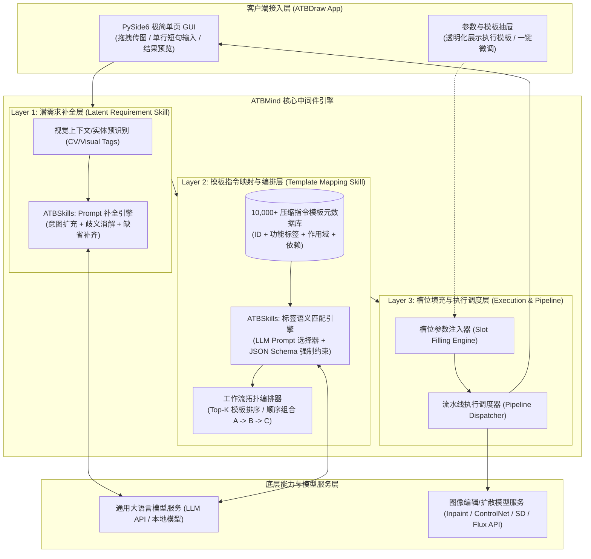
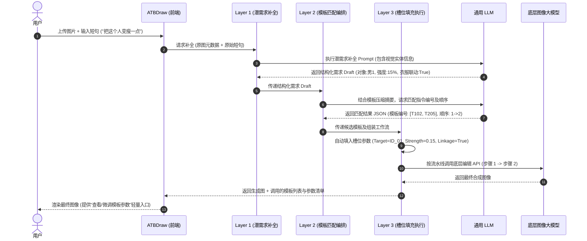
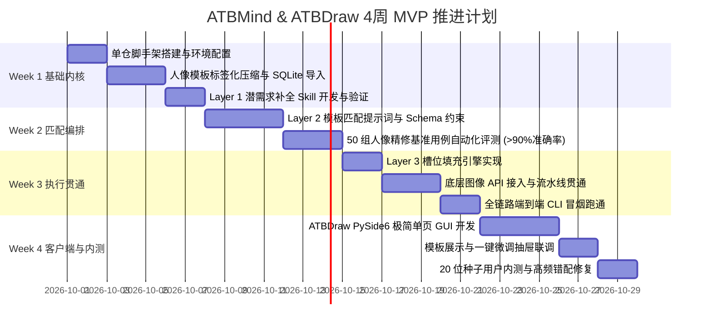

# ATBMind (心引) 项目设计与系统架构说明书

> **文档版本**: v1.0.0  
> **状态**: 草案 / MVP 设计阶段  
> **作者**: AI2BOX (aitobox) 架构组  
> **最后更新**: 2026-09-28  

---

## 1. 项目概述与核心愿景 (Project Overview & Vision)

### 1.1 问题背景与痛点深度分析
随着大语言模型与多模态 AI 的快速演进，人机交互形态正经历从传统 GUI 向自然语言对话（Chat/Agent）的范式转移。然而在实际落地（尤其是专业工具与创作领域）中，纯自然语言对话暴露出严重的体验与控制断层：

1. **语言带宽与视觉精细度的矛盾**：
   - 自然语言天生具有模糊性、非完备性。用户用口语难以精确传达复杂的视觉控制（如“把这个人变瘦一点”——缺少对象、性别、幅度、衣服联动等维度）。
   - 用户“不会说、说不全”，导致 AI 无法准确激活其深层控制能力，反复多轮对话试错成本极高。
2. **对话式交互丢失了传统菜单的“确定性与组合感”**：
   - 传统软件（如 Photoshop、CAD）通过层级菜单提供精细、可预测的功能组合路径（先 A，再 B，后 C）。
   - 对话式虽然直观，但用户很难直接用自然语言描述出稳定、可复现的多步骤精细编排。
3. **能力空转与断层**：
   - 底层 AI 模型往往具备极其强大的精细控制参数（如 ControlNet、LoRA、局部重绘、形态变形），但缺乏一层适配机制将人类的模糊口语翻译成底层的精密控制指令。

### 1.2 核心定位：ATBMind
**ATBMind** 是一个定位为 **“读心式领域结构化指令中间件” (Mind-reading Domain Instruction Middleware)** 的通用系统。

- **核心使命**：充当“人类模糊意图”与“底层专业 AI 精细能力”之间的心眼桥梁。
- **工作机制**：它不是凭空帮用户臆造需求，而是专注于 **“缺省补全 (Default Completion) + 歧义消解 (Disambiguation)”**。通过上下文与领域常识，将极简口语扩充为规范的结构化需求，并精准映射到系统已沉淀的成熟指令模板库，自动拼装成确定性的工作流执行。

```
+--------------------+      +-------------------------------------------+      +---------------------+
|    用户模糊表达    | ---> |                 ATBMind                   | ---> |    底层 AI / 模型   |
| "把这个人变瘦一点" |      | (潜需求补全 -> 模板映射组装 -> 槽位执行)  |      |  精细、确定性出图   |
+--------------------+      +-------------------------------------------+      +---------------------+
```

### 1.3 品牌渊源与命名释义
- **公司品牌**: **AI2BOX**（把 AI 能力封装进各种强大易用的魔盒中）。
- **统一前缀**: `ATB`（AI To Box 旗下软件标准家族前缀）。
- **产品名称**: **ATBMind**。
  - **Mind 的意象**: “心眼 / 读心”。捕捉用户脑海与心底尚未言明、无法精确组织的真实潜意识需求，将其心意显化并精准落地。

### 1.4 跨场景泛化架构理念
ATBMind 虽从 **2D 图像精修与编辑** 起步，但其内核设计为 **“自然语言到领域结构化指令集”的通用映射层**。未来可横向扩展至：
- **3D 模型制作与参数化建模**
- **工业设计与 CAD 建模指令流**
- **生化/医药科学实验参数化流水线**
- **特定行业工作流自动化 (SaaS Workflows)**

**场景迁移只需替换三大资产**：
1. 该领域的成熟指令模板库（Template Library）
2. 该领域的实体识别与槽位词典（Entity & Slot Dictionary）
3. 对应场景的微量适配标注与前置提示词（Few-shot Adaptation）

---

## 2. 系统总体架构与解耦设计 (Architecture & Decoupling)

系统严格遵循“通用内核”与“场景外壳”的分离架构，分为通用中间件 `ATBMind Core` 和首个落地场景客户端 `ATBDraw`。

### 2.1 整体分层架构图



### 2.2 核心交互时序图 (Sequence Flow)



---

## 3. 核心子系统详细设计 (Detailed Subsystem Design)

### 3.1 Layer 1: 潜需求补全层 (Latent Requirement Completion)
#### 3.1.1 职责
消除口语中因信息省略导致的歧义，将一句话模糊需求展开为完备的结构化参数草稿。
- **实体锚定**：识别画面中有哪些潜在操作对象（如：图中检测到 2 男 1 女，最近对焦主体为 `Male_01`）。
- **缺省规则补齐**：如“变瘦”默认补全形体形变比例（常规取值 10%~15%），默认补齐“衣服跟随形变”规则。
- **边界约束保护**：避免形变导致的背景扭曲（自动增加背景锁定或 Inpaint Mask 约束）。

#### 3.1.2 结构化输出协议规范 (Draft Schema)
```json
{
  "request_id": "req_20260928_001",
  "original_prompt": "把这个人变瘦一点",
  "parsed_intent": {
    "action_category": "body_shaping",
    "primary_target": {
      "entity_id": "entity_01",
      "label": "person_male",
      "region_hint": "center_focused"
    },
    "parameters": {
      "intensity": 0.12,
      "direction": "slender",
      "clothing_adaptation": true,
      "background_preservation": true
    },
    "clarification_needed": false
  }
}
```

---

### 3.2 Layer 2: 模板指令映射与编排层 (Template Mapping & Orchestration)
业务核心资产是拥有的 **10,000+ 条经过生产验证的高精指令模板**。Layer 2 负责在此规模下实现精准检索与组装。

#### 3.2.1 模板元数据压缩与分箱规范 (Template Metadata Schema)
由于全量模板包含详细长文本和参数定义，不能直接全量塞进 LLM 上下文。我们对 10,000 条模板提取 **高度压缩的标签元数据 (Compressed Tag)**：
- **编号 (ID)**：全局唯一，如 `T_IMG_0102`
- **功能关键词 (Keywords)**：瘦身、修形、脸部微调
- **作用对象 (Scope)**：单人人像 / 局部五官 / 服饰
- **参数范围与依赖 (Params & Deps)**：强/中/弱，依赖前置 Mask

```yaml
# 压缩标签元数据示例 (约 20-30 tokens/条)
templates:
  - id: T_SHAPE_001
    name: "人像身体轮廓微调"
    category: "body"
    target: "single_person"
    effects: ["waist_slim", "shoulder_narrow"]
    intensity_range: [0.05, 0.30]
    dependencies: []
  - id: T_CLOTH_002
    name: "衣物贴合形变保持"
    category: "clothing"
    target: "garment"
    effects: ["cloth_deformation_sync"]
    intensity_range: [0.0, 1.0]
    dependencies: ["T_SHAPE_001"]
```

#### 3.2.2 提示词匹配机制 (Prompt-driven Selection)
采用 **分批分箱上下文 + 结构化 JSON 强约束**：
1. **粗筛过滤**：根据 Layer 1 解析出的 `action_category`（如 `body_shaping`），加载对应领域分箱的压缩模板索引（通常只有数百条，仅占用数千 Token）。
2. **大模型精准挑选**：LLM 仅充当分类器与编排器，**禁止自由发挥生成新指令**，仅允许返回匹配的模板 ID 与建议执行次序。

```markdown
<!-- ATBMind 系统提示词片段 -->
你是一个精密的领域指令匹配器。
输入：用户的结构化需求 Draft。
参考模板库：[压缩模板列表]
输出规范：仅返回严格的 JSON 数组，包含选定的模板 ID 及其执行拓扑顺序。严禁输出任何多余的解释。
```

---

### 3.3 Layer 3: 槽位填充与工作流执行层 (Execution & Pipeline Dispatcher)
#### 3.3.1 槽位参数自动填充 (Slot Filling Engine)
拿到匹配的模板集合后，将 Layer 1 中的参数值映射填入模板插槽：
```json
{
  "pipeline": [
    {
      "step": 1,
      "template_id": "T_SHAPE_001",
      "slots": {
        "target_mask": "mask_male_01",
        "slim_ratio": 0.12
      }
    },
    {
      "step": 2,
      "template_id": "T_CLOTH_002",
      "slots": {
        "sync_with": "step_1_output",
        "wrinkle_retention": 0.85
      }
    }
  ]
}
```

#### 3.3.2 模型执行与透明化回传
- 按拓扑执行底层图像模型流水线（如 ControlNet OpenPose / Depth / Inpaint）。
- **人机协同透明度**：在生成最终图片的同时，向客户端回传完整的执行清单（调用的模板名称、填入的关键参数）。允许高级用户一键展开抽屉，进行微调并重新触发。

---

## 4. 指令协议与开源/商业壁垒策略 (Protocols & Moat)

### 4.1 `ATBSkills` 协议格式定义
为了让通用大模型清晰识别 ATBMind 指令上下文，定义标准协议头：

```text
ATBSkills: v1.0 <domain-id>
Context-Type: intent-mapping | template-execution | default-completion
Namespace: aitobox.atbmind.<domain>
---
[Skill Payload / Prompts / Templates]
```

### 4.2 商业模式与护城河边界划分 (Moat vs Open Source)

| 资产类型 | 开放策略 | 商业考量与壁垒分析 |
| :--- | :--- | :--- |
| **基础 ATBSkills 提示词框架** | **开源 (Open Source)** | 建立行业标准，树立“读心式中间件”品牌认知，获取开发者社区反馈。 |
| **标准协议与通信规范** | **开源 (Open Source)** | 降低生态接入壁垒，吸引上层场景应用基于 ATBMind 开发。 |
| **10,000+ 工业级精修指令模板** | **私有商用壁垒 (Proprietary)** | 历经真实生成场景与专业修图师校准的高精度资产，不可替代。 |
| **用户意图到模板的真实映射数据** | **私有数据闭环 (Data Flywheel)** | 随着用户使用规模增长，形成高精度的 Intent-to-Template 对齐数据链。 |
| **垂直领域实体词典与私有标签** | **商业授权 / 企业订阅** | 针对企业客户或专业场景（工业设计/3D）的专属定制包。 |

---

## 5. 技术选型与工程架构 (Tech Stack & Implementation)

### 5.1 技术选型矩阵

| 分层 / 模块 | 技术选型 | 选型依据与决策理由 |
| :--- | :--- | :--- |
| **核心内核 (Core)** | **Python 3.11+** | 算法生态完善，丰富的 LLM 与图像处理工具库支持。 |
| **内部接口协议** | **FastAPI** | 高性能异步框架，原生支持 Pydantic 校验与 OpenAPI 文档，易于未来解耦服务。 |
| **本地 GUI (ATBDraw)** | **PySide6 (Qt for Python)** | 团队核心技术栈，开发极简桌面端生产力极高；同进程直接调用内核，零 IPC 损耗。 |
| **本地数据库** | **SQLite** | 零配置轻量化，足以支撑 MVP 阶段 10,000+ 模板元数据的检索与读写。 |
| **跨平台打包** | **Nuitka** | 将 Python 解释器与依赖打包为原生可执行文件，免去用户配置环境烦恼，分发极简。 |
| **底层 AI 模型接入** | **官方 HTTP SDK / REST API** | 解耦本地计算压力，通过云端或统一网关调用高性能视觉模型。 |

> **关于打包与性能的说明**：  
> 本系统的性能瓶颈在于 **云端/大模型 API 的调用延迟**，本地 Python 仅处理提示词拼接与模板槽位映射（耗时 < 50ms）。因此 Python 自身的执行速度完全不是瓶颈，Nuitka 用于解决分发与环境免装问题即可，无需重写底层。

### 5.2 代码仓库目录结构设计 (Monorepo)

MVP 阶段采用**单仓多模块架构**，统一版本、快速联调；待验证闭环后再拆分子包。

```
ATBMind/
├── .github/                     # CI/CD 与 Agent 配置
├── docs/                        # 架构设计与开发文档
│   └── design/
│       └── ATBMind-design.md
├── atbmind_core/                # [核心中间件] ATBMind 通用内核
│   ├── __init__.py
│   ├── api/                     # FastAPI 路由与接口定义 (可选服务化模式)
│   ├── engine/                  # 核心调度逻辑
│   │   ├── latent_completer.py  # Layer 1: 潜需求补全引擎
│   │   ├── template_matcher.py  # Layer 2: 模板匹配与编排引擎
│   │   └── pipeline_runner.py   # Layer 3: 槽位填充与执行调度
│   ├── storage/                 # SQLite 存储管理 (模板库、标签缓存)
│   │   ├── db.py
│   │   └── models.py
│   └── utils/
├── atb_skills/                  # [Skill 规范库] 分场景 Skill 提示词与模板集
│   ├── base/                    # 基础协议与解析器
│   └── domains/
│       ├── image/               # 图像精修场景 (首发 MVP)
│       │   ├── skills_prompt.md # 专属匹配 Skill 提示词
│       │   └── templates.json   # 压缩模板元数据列表
│       ├── text/                # 文本场景 (规划中)
│       └── model_3d/            # 3D 建模场景 (规划中)
├── atb_draw_app/                # [场景外壳应用] ATBDraw PySide6 客户端
│   ├── main.py                  # 桌面客户端入口
│   ├── views/                   # 视图层 (主窗口、图片拖拽区、微调抽屉)
│   ├── controllers/             # 视图与内核直连控制器
│   └── resources/               # 样式与静态资源
├── tests/                       # 单元与集成测试用例
│   ├── test_layer1_complete.py
│   ├── test_layer2_matcher.py
│   └── test_layer3_pipeline.py
├── scripts/                     # 辅助脚本 (模板压缩生成、Nuitka 打包脚本)
├── requirements.txt
└── README.md
```

---

## 6. 首个场景落地应用：ATBDraw MVP 规划

### 6.1 目标与用户体验闭环
`ATBDraw` 是 ATBMind 的首个验证外壳，专门针对人像与图像精修场景：
1. **输入阶段**：用户拖入一张待编辑人像照片，并在文本框随手输入大白话（例如：“把右边的人稍微瘦身，衣服别变形”）。
2. **处理阶段**：
   - 界面显示“心眼读心解析中...”（Layer 1 自动识别右侧人物、锚定形体与衣物联动）。
   - 界面显示“智能工作流组装中...”（Layer 2 自动命中瘦身与衣物平滑模板）。
   - 界面显示“渲染中...”（Layer 3 调度图像模型局部重绘）。
3. **交付阶段**：
   - 展示高清修后对比图。
   - 侧边提供轻量折叠抽屉：清晰显示命中模板 `[T_SHAPE_001, T_CLOTH_002]`，参数滑块预设为 `12%`。用户可直接在滑块上拖拽微调，重跑 Layer 3。

---

## 7. 实施计划与里程碑 (Roadmap & Milestones)

针对独立开发者日常精力分配（保持已有商业 App 稳定流水，每日分配 2~3 小时轻启动），制定为期 **4 周的 MVP 敏捷落地节奏**：



### 阶段产出标准
- **W1 结束**：输入测试口语，能够稳定输出规范的 JSON 格式结构化需求 Draft。
- **W2 结束**：50 组典型人像测试短句中，模板 ID 与组合顺序的推荐准确率达到 90% 以上。
- **W3 结束**：跑通命令行无头模式下的全链路（从输入图 + 短句，到输出修改后的成品图）。
- **W4 结束**：完成 PySide6 桌面端打包，完成第一轮 20 人真实用户盲测，收集首批意图映射对齐数据。

---

## 8. 总结与后续演进 (Summary & Future Scope)

ATBMind 从底层解决了自然语言“模糊性”与工业级工具“精密性”之间的代沟。通过将 10,000+ 专属模板资产进行轻量元数据建模，依托大模型的意图扩充与结构化匹配能力，以最低的计算资源成本打造出高度可控的 Agentic 中间件。

### 后续演进路线：
1. **引入轻量向量缓存**：随着调用量增加，对高频意图与模板组合进行 Embedding 语义缓存，降低大模型 Token 开销与响应延迟。
2. **多模态圈选交互**：在 ATBDraw 中引入手势/框选辅助，真正实现“框选 + 口语短句 + 参数微调”的三位一体下一代交互。
3. **跨领域横向复制**：在图像修图验证商业模式后，将模板集与 Skill 提示词扩展至 3D 建模与设计制造领域。
