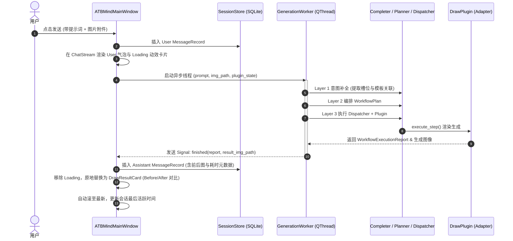

# ATBMind 桌面端 UI 重构与多轮插件化平台架构设计规范

- **状态**: Draft / Under Review
- **日期**: 2026-09-29
- **作者**: ATBMind Core Team
- **目标路径**: `docs/superpowers/specs/2026-09-29-atbmind-ui-redesign-design.md`

---

## 1. 背景与目标 (Context & Objectives)

### 1.1 背景
当前项目处于将专用绘图工具演进为通用 AI 智能体平台的关键阶段。此前，`apps/atb_draw_desktop` 实现了针对人像精修的独立原型客户端，采用固定卡片与右侧抽屉参数调节，缺乏多轮连续交互能力和多会话管理机制。

为了确立 **ATBMind** 作为核心应用框架的平台化定位（ATBDraw 仅作为其首个核心能力插件），需要对整个 UI 架构与数据流进行彻底重塑。新界面参考业界领先的 AI 对话范式（如豆包等现代客户端），打造优雅、高效的 macOS 原生质感桌面应用。

### 1.2 核心目标
1. **统一平台入口**：在 `apps/atbmind_desktop` 构建全新的旗舰级桌面主程序，使 ATBMind 成为多会话、多插件管理中心。
2. **多轮对话与流式渲染**：支持连续多轮人机交互，不仅支持通用 LLM 文本交流，更能在对话流中无缝渲染 ATBDraw 的多轮生图与精修对比结果卡片。
3. **可插拔底部控制台 (Pluggable Footer Dock)**：输入区域支持动态挂载插件。挂载 ATBDraw 时，自动呈现模型选择、长宽比、艺术风格浮层菜单 (Popover) 与修图模板下拉框。
4. **灵活多模态附件流**：输入框内置附件支持，用户可通过文件选取或拖拽上传人像原图，在输入栏生成微型缩略图卡片（Thumbnail Chip），支持随提示词一同提交。
5. **完整本地持久化**：会话元数据、历史聊天流与生成的图片路径全部持久化到 SQLite 数据库 (`data/atbmind.db`)；LLM API 配置持久化至 `configs/config.yaml`。
6. **异步流畅体验**：所有推理与图像生成逻辑移至后台 `QThread` 异步执行，界面状态实时响应，坚决避免主线程卡顿。

---

## 2. 总体架构与系统分层 (Architecture & Layering)

系统采用 **宿主-插件解耦 (Host-Plugin Decoupling)** 与 **事件驱动状态机 (Event-Driven State Machine)** 模式，整体划分为四层：

```
+-----------------------------------------------------------------------------------+
|                              Presentation Layer (PySide6)                         |
|  [SidebarWidget]         [ChatStreamView]                  [FooterDock]           |
|  - + 新对话 (⌘N)          - UserBubble (+Attachment Chip)   - PluginControlBar     |
|  - 历史会话列表            - AssistantBubble                 - StylePopover 网格    |
|  - ⚙️ 设置 (Settings)     - DrawResultCard (Before/After)   - PromptInput (+Chip)  |
+-----------------------------------------+-----------------------------------------+
                                          | Signals / State Actions
+-----------------------------------------v-----------------------------------------+
|                               State & Coordinator Layer                           |
|  [UIStateManager]                [SessionController]       [GenerationWorker]     |
|  - 管理当前 Session 指针           - 驱动消息增删改查         - QThread 异步管线     |
|  - 插件 UI 挂载/卸载切换          - 标题自动摘要提炼         - 进度与异常状态分发   |
+-----------------------------------------+-----------------------------------------+
                                          | Data Access & Invocations
+-----------------------------------------v-----------------------------------------+
|                                Core Engine & Plugins                              |
|  [ATBMind Core Engines]         [Plugin System]            [ATBDraw Plugin]       |
|  - Completer / Planner          - PluginRegistry           - DrawVisionExtractor  |
|  - Dispatcher / LLMClient       - PluginUISpec 声明契约    - ImageModelAdapters   |
+-----------------------------------------+-----------------------------------------+
                                          | Persistence
+-----------------------------------------v-----------------------------------------+
|                                  Storage Layer                                    |
|  [SessionStore (SQLite)]                                   [ConfigManager (YAML)] |
|  - tables: sessions, messages                              - configs/config.yaml  |
+-----------------------------------------------------------------------------------+
```

---

## 3. UI 布局与详细组件规范 (UI Layout & Component Specifications)

主界面尺寸默认为 `1200 x 780`，最低适配 `1024 x 640`，整体配色遵循 Apple HIG 浅色系风格（系统级高精圆角与微边框）。

### 3.1 左侧侧边栏 (`SidebarWidget`)
* **宽度**：固定 `250px`，背景色 `#f7f7f8`，右边缘浅灰分界线 `#e5e5ea`。
* **顶部 Branding 与新建入口**：
  * 应用 Logo 与标题 `ATBMind`（16px 粗体）。
  * **`+ 新对话` 按钮**：高亮悬浮按钮，支持快捷键 `Cmd+N`。触发后，在状态机中生成新 Session 并重置右侧工作区。
* **中部会话历史列表 (`SessionListView`)**：
  * 采用自定义 ItemDelegate 或卡片列表展示历史会话。
  * 列表按 `updated_at` 倒序排列。
  * 每项展示：会话标题、时间戳、插件小徽章（如绘图会话带有 🎨 小图标）。
  * 悬浮态与右键菜单：支持「重命名」和「删除会话」。
* **底部设置栏**：
  * 包含当前环境与版本信息，以及 `⚙️ 设置` 按钮。
  * 点击弹出全局模态对话框 `SettingsDialog`。

### 3.2 中央多轮对话流 (`ChatStreamView`)
* **顶部信息条 (`ChatHeaderBar`)**：
  * 展示当前会话标题（支持双击直接就地重命名编辑）。
  * 挂载插件指示器：如当前会话启用了绘图，显示 `[🎨 ATBDraw: 图像生成]` 徽章。
  * 右侧操作：清空本会话历史上下文、删除会话快捷按钮。
* **滚动容器 (`QScrollArea`)**：
  * 垂直流式布局，底部加 stretch，收到新消息时平滑滚动至最下方。
* **消息组件渲染**：
  1. **用户消息气泡 (`UserMessageItem`)**：
     * 右对齐或左侧高亮气泡。
     * 若包含附件图片，在文字上方展示带圆角的原图缩略预览（可点击全屏放大）。
     * 文字内容清晰呈现修图或对话意图。
  2. **普通助手气泡 (`AssistantTextMessageItem`)**：
     * 用于普通聊天或绘图过程中的思维链反馈，支持文本换行与代码块。
  3. **ATBDraw 结果对比卡片 (`DrawResultCard`)**：
     * 双列并排对比展示：左侧 `Before (原图)`，右侧 `After (精修效果)`。
     * 图片支持保持长宽比缩放展示，边缘圆角 `8px`。
     * 卡片下方信息栏：
       * 模板标签：如 `[全身显瘦]`、`[双频磨皮]`；
       * 性能耗时：如 `耗时: 1.2s`；
       * 动作工具栏：`[🔍 放大查看]`、`[💾 另存为]`、`[↺ 以此结果微调]`。

### 3.3 底部可插拔 Footer 栏 (`FooterDock`)
吸附于中央主区域底部，采用外层悬浮式容器设计（圆角 16px、背景纯白 `#ffffff`、柔和边框与阴影），包含两层结构：

#### 1. 上层：插件动态控制栏 (`PluginControlBar`)
* **插件胶囊标签**：显示 `[🖼️ 图像生成 (ATBDraw) ✕]`。
  * 点击 `✕`：卸载插件，切换为普通大模型通用对话模式。
  * 在普通模式下显示 `[+ 载入插件]` 按钮，支持点击一键载入 ATBDraw。
* **模型选择器 (Model Dropdown)**：
  * 选项源自插件声明：`Seedream 4.5`、`Flux.1`、`SDXL`、`Mock Adapter`。
* **比例选择器 (Aspect Ratio Dropdown)**：
  * `自动`、`1:1`、`16:9`、`9:16`、`3:4`。
* **艺术风格弹出浮层 (`StylePopover`)**：
  * 按钮文案随当前选中风格动态更新（如 `🎨 人像摄影 ∧`）。
  * 点击向上弹出一个漂亮的网格浮层（完全还原豆包体验）：
    * 包含：人像摄影、电影写真、中国风、动漫、3D渲染、赛博朋克、水墨画、油画、古典、水彩画等。
    * 点击任意一项立即选定并折叠浮层。
* **修图模板下拉框 (Template Selector)**：
  * 自动从 `seed_templates.json` / SQLite 模板库中加载模板，默认包含：
    * `智能全身显瘦塑形`
    * `双频原生磨皮`
    * `面部立体轮廓微雕`
    * `服装边缘防畸变锁定`

#### 2. 下层：输入交互栏 (`PromptInputBar`)
* **`+` 图片附件按钮**：
  * 支持文件弹窗选取图片，同时整栏支持外部拖入图片文件。
  * 选中后在文本框内部左侧插入微型图片 Chip，附带删除角标 `✕`。
* **自适应多行输入框 (`AutoResizingTextEdit`)**：
  * 高度随文字行数在 `40px` 至 `120px` 之间弹性伸缩。
  * 占位文案：“输入描述或人像修图意图...”。
  * 快捷键：`Enter` 发送；`Shift+Enter` 换行。
* **发送/停止按钮**：
  * 常规状态：蓝色圆形发送图标按钮。
  * 执行中状态：转为旋转加载动效或停止按钮。

### 3.4 设置弹窗 (`SettingsDialog`)
模态对话框，支持配置并热更新全局 LLM API 参数：
* **Provider**：OpenAI / DeepSeek / Ollama / Local。
* **Base URL**：例如 `https://api.openai.com/v1`。
* **API Key**：密码掩码输入，支持明文切换。
* **Model**：如 `gpt-4o`、`deepseek-chat`。
* **Temperature**：滑动条（0.0 ~ 1.0）。
* **操作按钮**：`测试连接`、`保存`、`取消`。保存时自动持久化至 `configs/config.yaml` 并热更新当前运行期单例。

---

## 4. 数据模型与存储架构设计 (Data Models & Storage Schema)

### 4.1 SQLite Schema (`data/atbmind.db`)

新增 `SessionStore` 管理模块，与现有的 `TemplateStore` 共享 SQLite 连接或统一收敛在 `data/atbmind.db`。

```sql
-- 会话元数据表
CREATE TABLE IF NOT EXISTS sessions (
    session_id TEXT PRIMARY KEY,
    title TEXT NOT NULL,
    active_plugin_id TEXT,             -- 默认 'draw'，为空表示纯文本会话
    plugin_state TEXT,                  -- JSON 序列化: {model, aspect_ratio, style_id, template_id}
    created_at REAL NOT NULL,
    updated_at REAL NOT NULL
);

-- 消息流记录表
CREATE TABLE IF NOT EXISTS messages (
    message_id TEXT PRIMARY KEY,
    session_id TEXT NOT NULL,
    role TEXT NOT NULL,                -- 'user' | 'assistant' | 'system'
    content TEXT NOT NULL,             -- 提示词或回复文本
    attachment_path TEXT,              -- 关联的原图文件本地路径 (可为空)
    plugin_id TEXT,                    -- 执行此消息的插件 ID (如 'draw')
    plugin_payload TEXT,               -- JSON: {before_img, after_img, plan, report, elapsed_seconds}
    created_at REAL NOT NULL,
    FOREIGN KEY(session_id) REFERENCES sessions(session_id) ON DELETE CASCADE
);

CREATE INDEX IF NOT EXISTS idx_sessions_updated ON sessions(updated_at DESC);
CREATE INDEX IF NOT EXISTS idx_messages_session_time ON messages(session_id, created_at ASC);
```

### 4.2 Pydantic 核心数据类 (`atbmind_core/plugins/schemas.py`)

```python
class SessionRecord(BaseModel):
    session_id: str
    title: str = "新对话"
    active_plugin_id: Optional[str] = "draw"
    plugin_state: Dict[str, Any] = Field(default_factory=dict)
    created_at: float
    updated_at: float

class MessageRecord(BaseModel):
    message_id: str
    session_id: str
    role: str  # 'user' | 'assistant'
    content: str
    attachment_path: Optional[str] = None
    plugin_id: Optional[str] = None
    plugin_payload: Optional[Dict[str, Any]] = None
    created_at: float

class PluginUISpec(BaseModel):
    plugin_id: str
    display_name: str
    icon: str
    supports_attachments: bool = True
    attachment_types: List[str] = Field(default_factory=lambda: [".png", ".jpg", ".jpeg", ".webp"])
    models: List[str] = Field(default_factory=list)
    aspect_ratios: List[str] = Field(default_factory=list)
    styles: List[Dict[str, str]] = Field(default_factory=list)
    templates: List[TemplateMetadata] = Field(default_factory=list)
```

---

## 5. 插件协议与异步交互流 (Plugin Protocol & Async Flow)

### 5.1 插件扩展契约
`ATBMindPlugin` 基类扩展 `get_ui_spec()` 方法：
* `DrawPlugin.get_ui_spec()` 返回声明的参数字典；
* 宿主 `FooterDock` 根据 `get_ui_spec()` 动态装配风格、模型及模板；
* 结果渲染通过 `DrawResultCard` 独立解耦实现，宿主仅传递结构化 `plugin_payload`。

### 5.2 异步执行时序 (`GenerationWorker`)



---

## 6. 测试与质量保证策略 (Testing & Quality Strategy)

1. **会话存储单元测试 (`tests/test_session_store.py`)**：
   - 验证 Session 创建、按最新时间降序获取、修改标题；
   - 验证 Message 顺序追加、按会话 ID 隔离检索；
   - 验证级联删除：删除 Session 时对应所有 Messages 彻底清理。
2. **配置持久化测试 (`tests/test_config.py`)**：
   - 测试更新并回写 `configs/config.yaml`；
   - 保证环境变量与文件配置的正确继承与重写。
3. **桌面端 PySide6 自动化集成测试 (`tests/test_atbmind_desktop.py`)**：
   - 使用 `pytest-qt` 的 `qtbot`；
   - 验证窗口各组件初始化（Sidebar、ChatStream、FooterDock、SettingsDialog）；
   - 模拟用户点击 `+ 新对话`、切换会话；
   - 模拟上传图片附件并发送，验证 `GenerationWorker` 完成后卡片正确出现在 `ChatStream` 中；
   - 验证在设置弹窗中修改 LLM 参数并成功保存。
4. **向后兼容验证**：
   - 确保原有的 52 项单元测试 100% 保持绿色通过。

---

## 7. 实施里程碑计划 (Implementation Roadmap)

| 阶段 | 核心任务 | 交付成果 |
| :--- | :--- | :--- |
| **M1: 存储与配置持久化基石** | 实现 `SessionStore` (SQLite 表结构与 CRUD)，并在 `atbmind_core/config.py` 实现配置双向写入保存。 | `session_store.py` + 完整持久化单元测试 |
| **M2: 插件 UI 契约与 ATBDraw 卡片适配** | 扩展 `PluginUISpec` 契约，在 `plugins/draw` 中开发 `DrawResultCard` 对比卡片与 UI 规格声明。 | 插件 UI 契约规范与测试卡片 |
| **M3: 核心桌面界面与交互组件构建** | 构建 `SidebarWidget`、`ChatStreamView`、`FooterDock`、`StylePopover` 及 `SettingsDialog`；组装 `ATBMindMainWindow`。 | `apps/atbmind_desktop/` 完整 UI 视觉与骨架 |
| **M4: 异步流串联与端到端自动化测试** | 接入 `GenerationWorker`，串联多轮对话流、图片附件装配与持久化加载，编写 `qtbot` 全量测试。 | 52+ 个全绿自动化测试，可启动的桌面主程序 |
