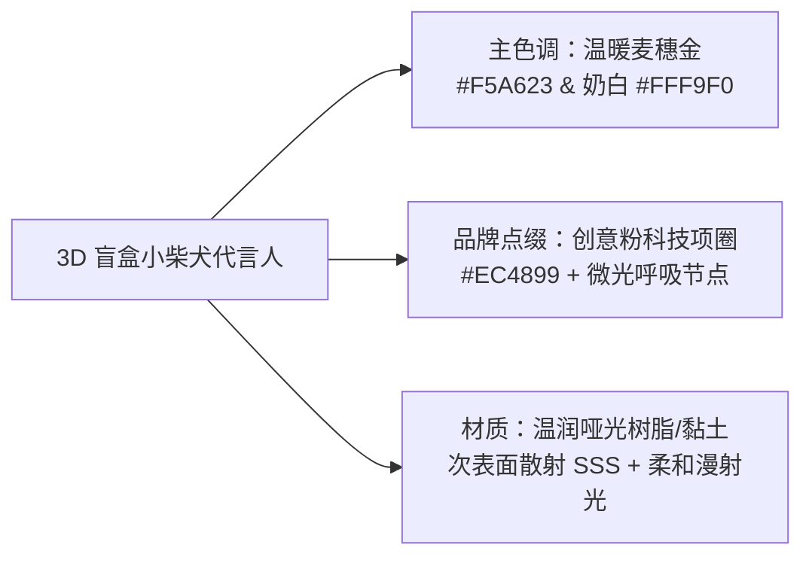

# ATBMind 品牌代言人 IP 形象设计与全套视觉资产替换规范 (Design Spec)

**日期**：2026-10-08  
**状态**：待评审 (Pending Review)  
**作者**：ATBMind Core Team  
**对应需求**：设计卡通可爱虚拟小动物代言人形象，生成并系统级替换现有 Logo、应用图标及界面相关资产  

---

## 1. 背景与目标

### 1.1 现状与需求
ATBMind 作为基于精简 Harness Loop 内核与多专家协同的桌面级 AI 智能体工作台，拥有以 macOS Apple HIG 为基调的高品质原生桌面界面。在视觉呈现上，系统目前缺乏一个具备高度亲和力、辨识度和情感连接的品牌代言人（Mascot / IP 形象）。

用户期望：
1. **代言人 IP 形象确立**：设计一个温暖、忠诚、元气满满的卡通虚拟小动物形象作为 ATBMind 的官方桌面代言人；
2. **美术风格统一**：采用 3D 盲盒黏土 / 轻质感立体风（Claymation / Stylized 3D Vinyl Toy），融合 ATBMind 的经典画布色与创意粉（`#EC4899`）品牌点缀；
3. **全套视觉资产生成与规范化**：建立标准多分辨率 macOS 应用图标（Squircle 圆角矩形）、透明底头像特写、全高清立绘及 ICNS 图标包；
4. **全系统生命周期替换**：深度替换 macOS Dock 图标、窗口图标、左侧导航侧边栏（`NavigationSidebar`）品牌区域、设置与关于对话框（`SettingsDialog`）以及项目 `README.md`。

### 1.2 核心交付与成功指标
1. **IP 形象规范与原画落地**：生成包含主立绘（`mascot_hero.png`）、头像切图（`mascot_avatar.png`）与母版应用图标（`app_icon_1024.png`）的基准资产。
2. **多尺寸资产自动处理管线**：提供脚本 `scripts/generate_brand_assets.py`，使用 Lanczos 算法自适应生成 16×16、32×32、64×64、128×128、256×256、512×512、1024×1024 PNG 及 macOS 原生 `app_icon.icns`。
3. **统一资产解耦层 (`BrandAssets`)**：在 `apps/atbmind_desktop/theme.py` 封装集中式资产提供类，支持多分辨率 `QIcon` 缓存与优雅降级。
4. **运行时与静态文档全面替换**：
   - macOS Dock 图标 & 窗口标题栏图标同步更新；
   - 导航侧边栏顶部植入精致的品牌头像与 "ATBMind" 专属排版；
   - "关于"对话框展示代言人卡片与版本信息；
   - 根目录 `README.md` 更新品牌标志与代言人形象；
5. **测试保障**：新增 `tests/test_brand_assets.py` 针对资源有效性与 `BrandAssets` 提供者进行自动化测试，确保原有测试套件 100% 保持通过。

---

## 2. 角色设定与视觉设计体系

### 2.1 角色人设（Character Identity）
* **物种原型**：治愈系金毛小柴犬（Shiba Inu）。
* **角色定位**：ATBMind 桌面智能伙伴（"Your Loyal & Clever AI Desktop Companion"）。
* **性格特质**：温暖可靠、机敏好奇、元气满满、忠诚伴随。

### 2.2 视觉特征与材质色彩


* **形态结构**：
  * 面部：饱满嘟嘟脸，微微翘起的小嘴角，灵动纯澈的深棕圆黑眼睛与湿润黑鼻头。
  * 耳部：圆润钝角的直立三角耳，耳内绒毛柔软干净。
  * 专属配饰：佩戴一条精致的 **ATBMind 创意粉**（`#EC4899`）哑光科技小领结/轻量智能项圈，领结正中嵌有一颗极小微发光的青粉渐变指示灯，代表其连接着 ATBMind 底座内核与专家大脑。
* **光影与材质**：
  * 材质为温润亚光高级软陶（Polymer Clay / Vinyl），无塑料油腻反光；
  * 布光为经典的柔和摄影棚三点漫射布光（Studio Key, Fill, Rim Light），阴影温和干净。

---

## 3. 资产架构与目录结构

所有生成的品牌资源将归档在 `resource/assets/brand/` 目录：

```text
resource/assets/brand/
├── mascot_hero.png              # 1024×1024 高精盲盒立绘（关于对话框、欢迎页、封面展示）
├── mascot_avatar.png            # 512×512 透明底头像特写（侧边栏 Header、列表头像）
├── app_icon_1024.png            # 1024×1024 macOS 标准 Squircle 连续曲率应用图标母图
├── app_icon_512.png             # 512×512
├── app_icon_256.png             # 256×256
├── app_icon_128.png             # 128×128
├── app_icon_64.png              # 64×64
├── app_icon_32.png              # 32×32 (经微型尺寸锐化微调)
├── app_icon_16.png              # 16×16 (经微型尺寸锐化微调)
└── app_icon.icns                # macOS 原生多层 ICNS 打包文件（供打包构建 DMG 使用）
```

### 3.1 尺寸与导出规范
| 规格文件名 | 尺寸 (px) | 色彩模式 | 核心用途 |
|---|---|---|---|
| `mascot_hero.png` | 1024×1024 | RGB/RGBA | 宣传封面、README、关于弹窗主视觉卡片 |
| `mascot_avatar.png` | 512×512 | RGBA (透明底) | 导航侧边栏 Header 品牌徽标、小尺寸头像下采样源 |
| `app_icon_1024.png` | 1024×1024 | RGBA | macOS 原生 Squircle 圆角矩形底座应用图标母版 |
| `app_icon_512.png` | 512×512 | RGBA | 标准应用大图标、Retina 2x 显示器展示 |
| `app_icon_256.png` | 256×256 | RGBA | 标准窗口图标展示、Finder 视图 |
| `app_icon_128.png` | 128×128 | RGBA | 关于对话框小图标、README 内嵌徽标 |
| `app_icon_64.png` | 64×64 | RGBA | 对话框弹窗通知图标 |
| `app_icon_32.png` | 32×32 | RGBA | 窗口标题栏、macOS 任务栏非 Retina 模式 |
| `app_icon_16.png` | 16×16 | RGBA | 菜单栏与超紧凑状态视图 |
| `app_icon.icns` | 多图层集 | ICNS 容器 | macOS 应用安装包打包 (`pyinstaller`/`nuitka`) |

---

## 4. 软件工程与 UI 集成实现细节

### 4.1 统一品牌资源提供层 (`BrandAssets`)
在 `apps/atbmind_desktop/theme.py` 中增加 `BrandAssets` 提供者单例/静态方法集合：

```python
class BrandAssets:
    """Centralized brand asset provider for ATBMind Desktop."""
    
    @classmethod
    def get_app_icon(cls) -> QIcon:
        """Returns multi-resolution QIcon containing all available resolutions."""
        ...
        
    @classmethod
    def get_mascot_avatar(cls, size: int = 24) -> QPixmap:
        """Returns cached high-DPI mascot avatar pixmap."""
        ...
        
    @classmethod
    def get_mascot_hero(cls) -> QPixmap:
        """Returns full mascot hero pixmap."""
        ...
        
    @classmethod
    def get_brand_dir() -> Path:
        """Returns the canonical brand assets directory path."""
        ...
```

* **优雅降级与防御性设计**：如果静态图片在开发或测试环境不存在，`BrandAssets.get_app_icon()` 将安全返回由矢量绘制或者内嵌 SVG 构成的缺省图标，不抛出异常。

### 4.2 模块接入与替换点清单
1. **主程序入口 (`apps/atbmind_desktop/main.py`)**：
   - 在 `create_app()` 中调用：
     ```python
     app.setWindowIcon(BrandAssets.get_app_icon())
     ```
2. **主窗口装配 (`apps/atbmind_desktop/main_window.py`)**：
   - 在 `ATBMindMainWindow.__init__()` 中调用：
     ```python
     self.setWindowIcon(BrandAssets.get_app_icon())
     ```
3. **左侧导航栏 (`apps/atbmind_desktop/widgets/navigation_sidebar.py`)**：
   - 在侧边栏顶部窗口控制栏与会话列表之间，引入 `BrandHeaderWidget`：
     - 左侧放置 26×26 圆角代言人头像（`BrandAssets.get_mascot_avatar(26)`）；
     - 右侧显示 "ATBMind" 标题文本（Space Grotesk / 苹果加粗 13px）及微型版本标（如 "v0.1.0"）；
     - 支持在侧边栏折叠为极简图标状态（仅显示头像微标）。
4. **设置与关于对话框 (`apps/atbmind_desktop/widgets/settings_dialog.py`)**：
   - 在 General 或专属 "About" 标签页中，置入 80×80 `BrandAssets.get_mascot_hero()` 圆角形象卡片，标注产品名、Slogan 及致谢。
5. **项目主文档 (`README.md`)**：
   - 将顶栏标题居中区域链接更新为全新的代言人应用图标（`resource/assets/brand/app_icon_128.png`）。

---

## 5. 资产生成与处理脚本管线 (`scripts/generate_brand_assets.py`)

实现一个完全独立的自动化预处理脚本，职责包括：
1. **母图规范检查**：验证源图像尺寸与色彩通道；
2. **Apple HIG Squircle 裁剪与投影合成**：对 1024×1024 原图生成标准 Squircle（平滑曲率圆角矩形）遮罩与下边距微投影；
3. **Lanczos 多级缩放**：输出 512, 256, 128, 64, 32, 16 像素全套 PNG；
4. **macOS ICNS 生成**：若运行在 macOS 平台，调用内置的 `iconutil` 命令行工具将 `.iconset` 打包为标准 `app_icon.icns`；若非 macOS 或缺少工具，则使用 Pillow / 纯 Python 格式兼容打包。

---

## 6. 测试与验证策略

### 6.1 单元测试 (`tests/test_brand_assets.py`)
1. **资产完整性测试**：
   - 验证 `resource/assets/brand/` 目录下所有规格的 PNG 文件均存在且大小大于 0 字节；
   - 验证各规格图片的分辨率严格符合 16, 32, 64, 128, 256, 512, 1024 尺寸；
   - 验证图片颜色模式为 `RGBA` 或 `RGB`。
2. **`BrandAssets` 提供者功能测试**：
   - 验证 `BrandAssets.get_app_icon()` 返回有效且非空的 `QIcon` 实例；
   - 验证 `BrandAssets.get_mascot_avatar(size=24)` 返回指定宽高的有效 `QPixmap`；
   - 验证在缺失指定文件时的降级逻辑不崩溃。

### 6.2 整体回归测试
* 执行工程标准测试指令：
  ```bash
  PYTHONPATH=src conda run -n ATBMind python -m pytest tests/
  ```
* 确保所有既有 179+ 单元测试均持续保持通过，无破坏性改动。
