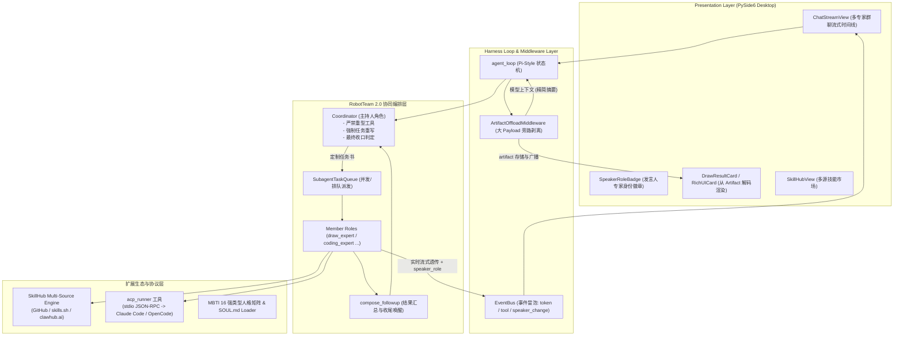
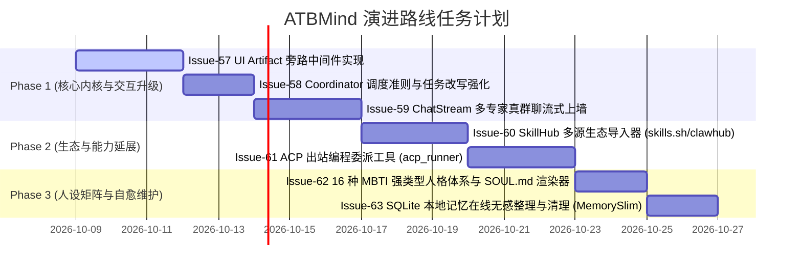

# ATBMind 借鉴 Octop 架构演进与功能落地设计规范 (Design Spec)

**文档编号**：SPEC-2026-10-08-OCTOP-ADOPTION  
**日期**：2026-10-08  
**状态**：待评审 (Pending Review)  
**作者**：ATBMind Core Team  
**参考**：[TencentCloud/Octop](https://github.com/TencentCloud/Octop) / [ATBMind RobotRole-Skill Architecture](2026-10-07-robotrole-skill-architecture-design.md)

---

## 1. 背景与架构理念对齐

### 1.1 现状与技术同源性
在 2026-10-08 的探索调研中，团队对腾讯开源自托管多智能体平台 **TencentCloud/Octop** 进行了深度源码分析。研究发现，Octop 与 ATBMind 在系统核心哲学、角色编排范式以及开发方法论上高度契合：
1. **轻量状态机内核**：两者均摒弃了沉重的外部队列中间件，主张单进程内极简状态驱动（ATBMind 的 Pi-style `agent_loop` 与 Octop 的 `octop-harness`）。
2. **专家团队协同**：两者均推崇“主协调员/主持人 + 专精专家（Expert）”的协作拓扑。
3. **开放技能生态**：两者均将标准 `SKILL.md`（YAML frontmatter + 领域指引 + 脚本/工具体）作为首选能力扩充范式。
4. **工程铁律（Superpowers）**：两者均严格贯彻 TDD、书面计划、系统化调试与完成前实证验证的高标准工程规范。

### 1.2 现存痛点与演进目标
对比 Octop 的工程实践，ATBMind 现有实现存在以下亟待突破的关键瓶颈：
1. **富 UI 与大 Payload 污染大模型上下文**：目前工具执行返回的结构化卡片数据（如生图配置、提示词参数、长表单）直接进入 `ToolMessage.content`，在多轮对话中导致 Token 消耗急剧膨胀，且干扰模型推理。
2. **多角色协作临场感不足**：ATBMind 目前的 `delegate_task` 为串行后台委派，主聊天视窗缺乏“多专家群聊并列讨论、实时协同流式上墙”的交互张力；主协调员缺乏严格的“禁止自行干重活”机制约束。
3. **编程协作能力受限**：缺乏轻量将复杂代码编写/重构任务委托给专业外部 CLI（如 Claude Code、OpenCode）的通道。
4. **技能源单一**：现有 `SkillManager` 仅支持 GitHub 与本地目录，未打通 `skills.sh`、`clawhub.ai` 等新兴开源生态。
5. **角色人设结构松散**：角色缺乏深度的心理学人格维度与标准化行为规范矩阵。

本规范旨在系统性吸收 Octop 的精髓架构模式，规划为期三个阶段的落地技术方案。

---

## 2. 总体架构演进设计



---

## 3. 详细子系统规格设计

### 3.1 模块一：UI Artifact 旁路中间件 (`ArtifactOffloadMiddleware`)

#### 核心原理与数据流
针对返回富结构数据、大文本或复杂元数据的工具（例如绘图结果卡片、批量处理日志）：
1. 工具执行后返回包含 `atbmind_ui` 声明与 `data` 的结构化字典。
2. 中间件在进入 LLM 上下文之前进行拦截：
   - 当内容长度 $\ge 3000$ 字符且包含 `atbmind_ui` 标记时触发剥离；
   - 将完整 `data` 移至 `ToolResult.artifact`；
   - 原 `content` 替换为紧凑的纯文本摘要并附加 `"data_ref": "artifact"`。
3. 大模型推理请求转换器在构建 Prompt 时自动剔除 `artifact`（保持 Token 极小）。
4. 桌面客户端事件流（`agent_loop` 事件总线）与 SQLite 本地持久化保留完整 `artifact`，由前端组件无损渲染。

#### 数据结构契约
```python
# atbmind_core/harness/types.py

class ToolResult(BaseModel):
    tool_call_id: str
    tool_name: str
    content: str                          # 留给 LLM 的摘要文本
    artifact: dict[str, Any] | None = None # 前端专属大 Payload
    status: Literal["success", "error"] = "success"
```

```json
// 替换后的 content 样例 (进入模型上下文)
{
  "atbmind_ui": { "renderer": "draw_card", "version": 1 },
  "summary": "已成功生成 2 张 16:9 赛博朋克风格图像，路径: data/images/cyber_01.png",
  "data_ref": "artifact"
}
```

---

### 3.2 模块二：RobotTeam 2.0 真群聊与协调员准则

#### 主持人（Coordinator）三大约束铁律
1. **严格剥夺重型工具**：Coordinator 只能装备 `delegate_task`、`list_roles`、时间与短期记忆工具；严禁挂载 `generate_image`、`file_write`、`bash` 等重型工作工具。
2. **强制任务定制改写（Anti-Pass-Through）**：禁止原样转发用户原话，必须为目标专家生成包含【目标、边界约束、交付格式、必要上下文】的专业任务说明书。
3. **主持收口闭环（Closing & Synthesis）**：专家完成后，触发 `compose_followup` 唤醒主持人；主持人只做“任务是否已满足”的裁决并输出不超过 3 句的精简总结，严禁复述专家上墙的原文。

#### 实时流式转播与时间线融合
1. 专家在独立 Sub-Context 执行时，其流式 token 和工具事件冒泡至全局总线，每帧携带 `speaker_role: "draw_expert"`。
2. 桌面端 `ChatStreamView` 根据 `speaker_role` 动态分流，在主时间线上交替呈现主持人气泡与专家卡片，营造真正并肩作战的团队感。

```python
# atbmind_core/roles/delegation.py 派发事件结构
@dataclass
class TeamStreamChunk:
    speaker_role_id: str
    speaker_name: str
    speaker_avatar: str
    chunk_type: Literal["token", "tool_start", "tool_end", "card", "done"]
    payload: Any
```

---

### 3.3 模块三：SkillHub 多源聚合导入引擎

#### 多源适配规范
扩展 `atbmind_core/skills/manager.py`，支持以下源的自动探测、解析与下载：
1. **GitHub 仓库**：`https://github.com/<owner>/<repo>` 或带有 `/tree/<branch>/<subpath>` 的深层路径。
2. **Skills.sh 平台**：`https://skills.sh/<slug>`。
3. **ClawHub 市场**：`https://clawhub.ai/<slug>`。
4. **SkillsMP 生态**：`https://skillsmp.com/<slug>`。

#### 安全解包与沙箱防范
- 单技能包上限：文件数 $\le 100$，总解压体积 $\le 15\text{MB}$。
- 目录穿越防范：全面使用 `os.path.commonpath` 严格拦截 Zip Slip 风险路径。
- 自动化规范探测：必须包含有效的 `SKILL.md`，自动提取 YAML frontmatter 并验证规范性。

---

### 3.4 模块四：ACP (Agent Client Protocol) 出站编程协作元工具

#### 运作模式
1. 针对桌面端提出的重构、复杂算法编写等研发任务，角色无需自身承担重度 IDE 工作。
2. 实现 `acp_runner` 元工具，符合标准 Agent Client Protocol：
   - 寻找宿主机上的 `claude` (Claude Code) 或 `opencode` (OpenCode) 可执行文件。
   - 通过 stdio 管道启动子进程并维持 JSON-RPC 会话。
   - 交互指令支持：`start` (启动任务)、`message` (补充意图)、`respond` (权限确认)、`status` (状态查看)、`close` (结束)。

---

### 3.5 模块五：16 种 MBTI 强类型人格体系

#### 结构化数据模型
在 `atbmind_core/roles/schema.py` 中新增 `PersonalityProfile`：
- 四轴维度分值：`EI`（外向/内向）、`SN`（实感/直觉）、`TF`（思考/情感）、`JP`（判断/感知）。
- 6 种标准行为参数：`answer_style`（回答习惯）、`casual_chat`（闲聊风格）、`conflict_resolution`（分歧处理）、`creativity`（创意发散）、`empathy`（共情方式）、`planning`（规划条理性）。
- `SOUL.md` 渲染器：自动装配为角色 System Prompt 的灵魂基底骨架。

---

## 4. 实施阶段规划与分步任务 (Roadmap & Issues)



### 阶段一：核心内核与交互体验升级 (P1 - 最高优先级)
- **Issue-57: `ArtifactOffloadMiddleware` 实现与大 Payload 旁路**
  - 在 `atbmind_core/harness/` 引入中间件；
  - 拦截工具长输出，重构 `ToolResult` 支持 `artifact`；
  - 单元测试覆盖率 $\ge 95\%$。
- **Issue-58: Coordinator 主持人守则与定制任务改写器**
  - 剔除 Coordinator 的直接执行工具；
  - 注入 Anti-Pass-Through 消化模板与提示词；
  - 增加 `compose_followup` 闭环收口。
- **Issue-59: `ChatStreamView` 多专家流式身份上墙**
  - 扩展桌面端事件总线支持 `speaker_role`；
  - 气泡渲染器支持多专家头像、名称与状态徽章切换。

### 阶段二：生态扩展与工具协作 (P2)
- **Issue-60: SkillHub 多源导入支持**
  - 兼容 `skills.sh` / `clawhub.ai` / `skillsmp.com`；
  - 增加 URL 格式检验器与安全解包器。
- **Issue-61: ACP 出站编程元工具 (`acp_runner`)**
  - 实现标准 stdio JSON-RPC 包装；
  - 为编程专家绑定 ACP 调用能力。

### 阶段三：人设系统与持久化维护 (P3)
- **Issue-62: 16 种 MBTI 强类型人格体系**
  - 移植与本地化 16 个人格 dataclass；
  - 角色向导支持一键选择 MBTI。
- **Issue-63: 本地 SQLite 记忆在线压缩与孤立图片清理**
  - 编写后台自动整理调度器，实现安全 VACUUM。

---

## 5. 验收标准与测试策略

1. **测试驱动 (TDD)**：所有新增核心模块必须先书写失败测试，确保单元测试与集成测试全部通过。
2. **基线回归**：现有 338 项测试必须保持 100% 通过（`pytest tests/` Green）。
3. **性能基准**：
   - 引入 `ArtifactOffloadMiddleware` 后，带有 10KB 绘图参数的工具调用在下一轮对话中模型输入上下文减少 $\ge 80\%$；
   - 群聊流式事件延迟 $\le 50\text{ms}$，UI 界面不出现任何卡顿或跳帧。
