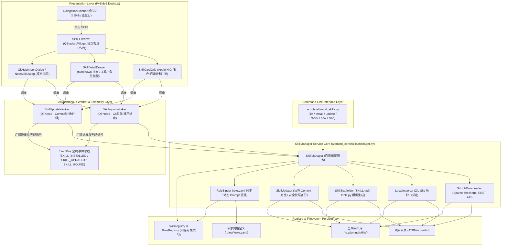
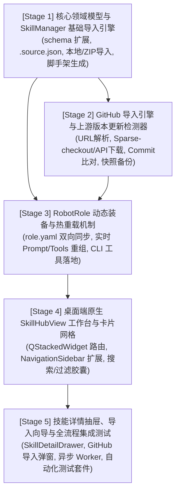

# ATBMind Skill Manager 集中管理、更新与导入系统设计规范 (Design Spec)

**日期**：2026-10-08  
**状态**：待评审 (Pending Review)  
**作者**：ATBMind Core Team  
**参考**：[skills-manager (GitHub)](https://github.com/xingkongliang/skills-manager) / [ATBMind RobotRole-Skill Architecture](docs/superpowers/specs/2026-10-07-robotrole-skill-architecture-design.md)

---

## 1. 背景与目标

### 1.1 现状与需求
在 ATBMind 2026-10-07 的架构升级中，系统成功将旧版 Plugin 体系演进为基于 **Harness Loop** 内核、**RobotRole 专家团队** 与 **开放 Skill 生态** 的现代化架构。目前系统内置了 `image_generation` 与 `core_tools` 两大核心技能。

然而，随着开源 Agent 技能生态（如 Claude Code / Cursor / skills.sh 技能库）的蓬勃发展，用户需要一种高效、直观的机制来管理技能：
1. **多源快速导入**：无法便捷地直接通过 GitHub 仓库或仓库子目录（如 `owner/repo/tree/main/skills/xxx`）或者本地目录/ZIP 归档一键导入技能。
2. **上游更新缺乏追踪**：从 GitHub 安装的技能缺乏版本追踪与差量检测能力，无法感知上游更新与安全升级。
3. **零门槛开发**：缺乏一键脚手架工具（Scaffolding）来快速创建规范的 `SKILL.md` 与 `tools.py`。
4. **可视化集中管理与角色装备**：缺乏直观的桌面工作台，使得用户难以一目了然地查看技能元数据、调试 Prompt 规则，以及向特定专家角色（如 `draw_expert` 或 `coordinator`）动态绑定/解绑技能。

### 1.2 核心目标
参考业界优秀的 `skills-manager` 设计，在 ATBMind 中打造原生、高内聚、模块化解耦的 **Skill Manager** 子系统：
1. **双层技能存储体系**：统一协调项目内置技能（`skills/`）与用户全局技能库（`~/.atbmind/skills/`）。
2. **多源导入与解析**：支持 GitHub 仓库（完整仓库 / 子目录 / Git Sparse-checkout / API 降级）与本地（目录 / ZIP）无缝导入。
3. **上游版本检测与安全更新**：通过 Git Commit SHA 与 `.source.json` 元数据比对，提供秒级更新检测、本地改动冲突保护与快照备份。
4. **规范脚手架生成**：内置标准化模板生成器，一键创建包含标准 YAML frontmatter 的 `SKILL.md` 和继承 `AgentTool` 的 `tools.py` 骨架。
5. **专家角色 (`RobotRole`) 热装配**：支持在 UI/CLI 界面将技能一键勾选装备至目标角色，自动更新 `role.yaml` 并热重载生效，无需重启应用。
6. **Apple HIG 原生桌面工作台 (`SkillHubView`)**：在桌面端提供原生全尺寸卡片流、实时检索与过滤胶囊、Markdown 预览抽屉与异步进度加载。
7. **全功能 CLI 支持**：提供 `scripts/atbmind_skills.py`，支持无 GUI 环境下的完整操作。

---

## 2. 总体架构与模块分层

系统划分为清晰的五层架构：



---

## 3. 核心领域模型与文件规范

### 3.1 文件组织结构
每个技能以独立目录形式存储于 `~/.atbmind/skills/<skill_id>/` 或 `skills/<skill_id>/` 中：
```text
~/.atbmind/skills/my_skill/
├── SKILL.md                 # 必备：YAML Frontmatter 元数据 + 领域规范与 Prompt 指南
├── tools.py                 # 可选：导出可执行的 AgentTool 子类
├── requirements.txt         # 可选：技能特定的依赖库声明
└── .source.json             # 管理器生成：记录上游来源与版本特征（用于差量更新）
```

### 3.2 来源元数据模型 (`.source.json`)
由管理器自动生成与维护，记录版本与追溯信息：
```json
{
  "source_type": "github",
  "repo_url": "https://github.com/xingkongliang/skills-manager",
  "branch": "main",
  "subpath": "skills/manage-skills",
  "installed_commit": "7a8b9c0d1e2f34567890abcdef1234567890abcd",
  "installed_at": 1728345600.0,
  "latest_upstream_commit": "7a8b9c0d1e2f34567890abcdef1234567890abcd",
  "has_update": false,
  "is_dirty": false
}
```

### 3.3 数据模型扩展 (`atbmind_core/skills/schema.py`)
```python
class SkillSourceInfo(BaseModel):
    source_type: Literal["github", "local", "scaffold", "builtin"] = "builtin"
    repo_url: Optional[str] = None
    branch: Optional[str] = "main"
    subpath: Optional[str] = None
    installed_commit: Optional[str] = None
    installed_at: Optional[float] = None
    latest_upstream_commit: Optional[str] = None
    has_update: bool = False
    is_dirty: bool = False

class SkillMetadata(BaseModel):
    name: str = Field(..., description="Unique skill name identifier")
    description: str = Field(default="", description="Human-readable skill description")
    version: str = Field(default="1.0.0", description="Semver version of the skill")
    tags: List[str] = Field(default_factory=list, description="Skill categorization tags")
    author: Optional[str] = Field(default=None, description="Author or maintainer name")
    repository: Optional[str] = Field(default=None, description="Source repository URL")
    enabled: bool = Field(default=True, description="Whether the skill is actively enabled")
    bound_roles: List[str] = Field(default_factory=list, description="List of role_ids binding this skill")
```

---

## 4. `SkillManager` 核心服务功能设计

`SkillManager`（`atbmind_core/skills/manager.py`）提供完整的领域操作 API：

### 4.1 GitHub 导入 (`import_from_github`)
1. **URL 解析**：
   - 提取 `owner`, `repo`, `branch`, `subpath`。
   - 示例：`https://github.com/foo/bar/tree/main/skills/calc` -> `owner='foo', repo='bar', branch='main', subpath='skills/calc'`.
2. **下载策略**：
   - 若系统检测到 `git` 命令可用：
     ```bash
     git clone --depth 1 --filter=blob:none --sparse https://github.com/foo/bar.git <temp_dir>
     cd <temp_dir> && git sparse-checkout set skills/calc
     ```
   - 若无 git 或网络异常降级：使用 GitHub API 递归获取文件并异步下载。
3. **合法性校验与注册**：
   - 必须包含合法的 `SKILL.md`（解析 frontmatter，缺失时基于目录名补全）；
   - 写入 `.source.json` 并复制至目标目录（默认 `~/.atbmind/skills/<name>`）；
   - 调用 `SkillRegistry.register_skill()` 载入内存，触发全局事件 `SKILL_INSTALLED`。

### 4.2 本地导入 (`import_from_local`)
1. **源路径验证**：支持本地文件夹或 `.zip` 归档。
2. **安全解包 (Anti-Zip Slip)**：
   - 验证所有条目的解压目标绝对路径必须位于目标根目录内，杜绝 `../` 越权攻击。
3. **结构规范化**：若 ZIP 内首层仅包含单一父文件夹，自动穿透解构。
4. **元数据写入**：记录 `source_type="local"` 并注册。

### 4.3 规范脚手架生成 (`create_skill`)
1. **输入参数**：`name: str`, `description: str`, `tags: List[str]`, `with_tools: bool`, `target_scope: str = "global"`。
2. **模板渲染**：
   - 渲染 `SKILL.md`，填充标准化 YAML 头部及系统提示词指引章节骨架；
   - 若 `with_tools=True`，生成标准 `tools.py` 示例：导出一个继承 `AgentTool` 的示范工具类（使用 Pydantic 定义 `parameters_schema` 与 `execute` 方法）。
3. **持久化与载入**：创建目录并写入 `.source.json`（`source_type="scaffold"`），注册至 `SkillRegistry`。

### 4.4 上游版本检测与安全升级 (`check_updates` / `update_skill`)
1. **非阻塞检测**：
   - 读取所有 `source_type="github"` 技能的 `repo_url` 与 `branch`；
   - 执行 `git ls-remote <repo_url> refs/heads/<branch>` 获取上游最新 Commit SHA；
   - 若与 `installed_commit` 不一致，设置 `has_update=True` 并回写 `.source.json`。
2. **安全更新流程**：
   - **快照备份**：更新前将当前技能目录完整归档至 `.backup/<skill_name>_<timestamp>`；
   - **拉取覆盖**：拉取上游最新内容并更新目标目录；
   - **热重载**：重新解析并替换 `SkillRegistry` 中的技能实例，广播 `SKILL_UPDATED` 事件。

### 4.5 角色 (`RobotRole`) 动态装备与解绑
1. **双向绑定维护**：
   - `bind_skill_to_role(role_id, skill_name)`：向 `roles/<role_id>/role.yaml` 的 `skills` 列表中添加 `skill_name`；
   - `unbind_skill_from_role(role_id, skill_name)`：从角色的 `skills` 列表中移除；
2. **即时热生效**：
   - 回写 `role.yaml`；
   - 调用 `RoleRegistry.reload_role(role_id)`，动态重建角色的 System Prompt（聚合注入所有 bound skills 的领域指南）与 Tool 执行体，实现无重启热更新。

---

## 5. 桌面端 UI 架构与交互设计 (`apps/atbmind_desktop`)

### 5.1 侧边栏与主窗口路由 (`NavigationSidebar` & `ATBMindMainWindow`)
1. **侧边栏扩展**：在 `NavigationSidebar` 的系统链接区增加 `btn_skills`（图标为 Apple HIG 拼图或积木图标 `puzzlepiece` / `square.stack.3d.up`）；
2. **QStackedWidget 视图切换**：
   - `WorkStreamArea` 内部中央区域改造为 `QStackedWidget`：
     - Page 0: `ChatStreamView`（原对话工作流，默认活动页面）；
     - Page 1: `SkillHubView`（技能中心主页面）；
   - 路由联动：
     - 点击侧边栏 `🧩 Skills`：切换至 Page 1，高亮侧边栏行；
     - 点击侧边栏任何会话或 `+ New Conversation`：切换至 Page 0，恢复对话视图。

### 5.2 技能中心工作台 (`SkillHubView`)
采用现代 Apple HIG 风格设计：
1. **顶部操作栏 (Header Toolbar)**：
   - 搜索输入框（圆角药丸框，实时模糊检索标题、描述与标签）；
   - 过滤标签群（Pills）：`全部`、`已启用`、`有更新 🔴`、`含工具代码`、`纯指南`、`项目内置`、`全局库`；
   - 动作按钮：`+ 新建技能`、`⬇️ 导入技能`（下拉菜单区分 GitHub / 本地）、`🔄 检查更新`。
2. **卡片网格列表 (SkillCardGrid)**：
   - 采用响应式流式布局（FlowLayout 或 Grid）；
   - 卡片元素：
     - 来源标签徽章（`[GitHub: owner/repo]` / `[Local]` / `[Project]`）；
     - 技能名称与版本号；
     - 简要描述（2行 Ellipsis）；
     - 标签 Pills；
     - 角色挂载徽标（显示已绑定的专家角色头像，如 🎨 `draw_expert`）；
     - 动作区：启用/禁用 Switch 开关、`Update` 升级按钮（有更新时高亮呈现）。
3. **详情抽屉 (`SkillDetailDrawer`)**：
   - 点击卡片右侧滑出抽屉（支持 ESC 或点击遮罩收起）；
   - Markdown 预览区：高保真渲染 `SKILL.md`；
   - 工具检查器：表格化展示 `AgentTool` 导出清单及入参说明；
   - 专家角色装备器：列出所有 `RobotRole`，通过 Checkbox 一键勾选绑定/解绑；
   - 管理动作：`检查更新`、`在 Finder 中打开`、`卸载技能`。

### 5.3 交互向导与进度反馈
- **`GitHubImportDialog`**：提供 URL 输入框、分支选择与自动解析预览。点击确定后启动异步 Worker；
- **异步进度交互**：导入与更新过程中卡片显示微型转轮或进度浮层，通过 `progress` 信号显示“正在克隆上游仓库...”、“正在校验规范...”，杜绝界面挂起假死。

---

## 6. 命令行 CLI 规范 (`scripts/atbmind_skills.py`)

提供开箱即用的命令行工具：
```text
用法: atbmind_skills.py [命令] [参数...]

命令列表:
  list                 列出所有已安装技能（支持 --role <role_id>, --json）
  show <skill>         查看技能详情与导出的工具清单
  install <url|path>   从 GitHub 仓库或本地路径/ZIP 安装技能（支持 --target global|project）
  new <name>           基于模板快速创建新技能（支持 --with-tools, --desc "..."）
  check                检测所有 GitHub 来源技能的上游更新状态
  update [<skill>]     拉取上游更新（支持 --all 批量更新）
  bind <role> <skill>  将指定技能装配给专家角色
  unbind <role> <skill>从专家角色解绑指定技能
  remove <skill>       卸载并删除指定技能
```

---

## 7. 异常处理与边界防护机制

| 异常场景 | 防护与恢复策略 |
|---|---|
| **GitHub 访问超时或限频 (403 Rate Limit)** | 限制超时时长（10s），提示用户可设置 `GITHUB_TOKEN` 或检查网络代理，避免无限阻塞。 |
| **恶性路径遍历 (Zip Slip 攻击)** | 解压前针对每一个压缩包文件头计算绝对目标路径，若发现路径超出目标文件夹则立即抛出安全异常并中止解压。 |
| **同名技能覆盖冲突** | 检测到同名技能已存在时，UI 提示确认模态框，CLI 提供 `--force` 或交互确认（覆盖 / 重命名另存 / 取消）。 |
| **`tools.py` 动态加载失败或语法错误** | 捕获 `SyntaxError` 与 `ModuleNotFoundError`，记录详细日志并在卡片展示警告徽章（`⚠️ 工具加载失败: ...`），保证宿主系统不崩溃。 |
| **本地修改被上游覆盖** | 更新前在 `.backup/` 自动备份当前版本，若检测到本地文件已被用户修改，提示用户并提供撤销备份机制。 |

---

## 8. 自动化测试矩阵

遵循项目现有规范（`conda run -n ATBMind pytest tests/`），覆盖 100% 关键路径：
1. **`tests/test_skills_manager.py`**：
   - 测试 GitHub URL 规范解析（单仓、多级子目录、短链接）；
   - 测试本地目录与 ZIP 导入；
   - 测试脚手架生成（`SKILL.md` 与 `tools.py` 的可加载性验证）；
   - 测试 `.source.json` 元数据读写。
2. **`tests/test_skills_updater.py`**：
   - Mock Git 远程命令，测试 Commit 对比与更新检测；
   - 测试备份快照生成与覆盖还原。
3. **`tests/test_skills_role_binding.py`**：
   - 测试 `bind_skill_to_role` 读写 `role.yaml`；
   - 验证角色 System Prompt 与 AgentTool 列表的动态热重载。
4. **`tests/test_skills_ui.py`**：
   - 基于 `pytest-qt` 测试 `SkillHubView` 的页面堆叠、卡片过滤与搜索；
   - 测试 `SkillDetailDrawer` 的展开与角色勾选事件绑定；
   - 测试 `SkillImportWorker` 异步信号与进度冒泡。
5. **`tests/test_skills_cli.py`**：
   - 验证 CLI 各子命令的执行、退出码及 JSON 输出模式。

---

## 9. 任务拆分与实施阶段规划 (DAG)

整个系统将拆分为 **5 个循序渐进的阶段任务**，后续通过 `atb-github-issue-creator` 转换为结构化 GitHub Issues：



- **Stage 1 (Core Foundations)**：扩展 `schema.py`，实现 `SkillManager` 本地/ZIP 导入与 `create_skill` 脚手架，单测验证。
- **Stage 2 (GitHub & Upstream Engine)**：实现 GitHub 仓库/子目录拉取、Commit 对比与安全快照更新。
- **Stage 3 (Role Binding & CLI)**：实现角色动态装备与热重载，发布 `scripts/atbmind_skills.py` CLI 命令行工具。
- **Stage 4 (Desktop UI - Hub & Grid)**：实现侧边栏导航跳转与 `SkillHubView` 卡片流、搜索过滤组件。
- **Stage 5 (Desktop UI - Drawer, Dialogs & E2E Tests)**：实现详情抽屉、角色装配勾选器、异步 Worker 进度条及全套自动化测试。
